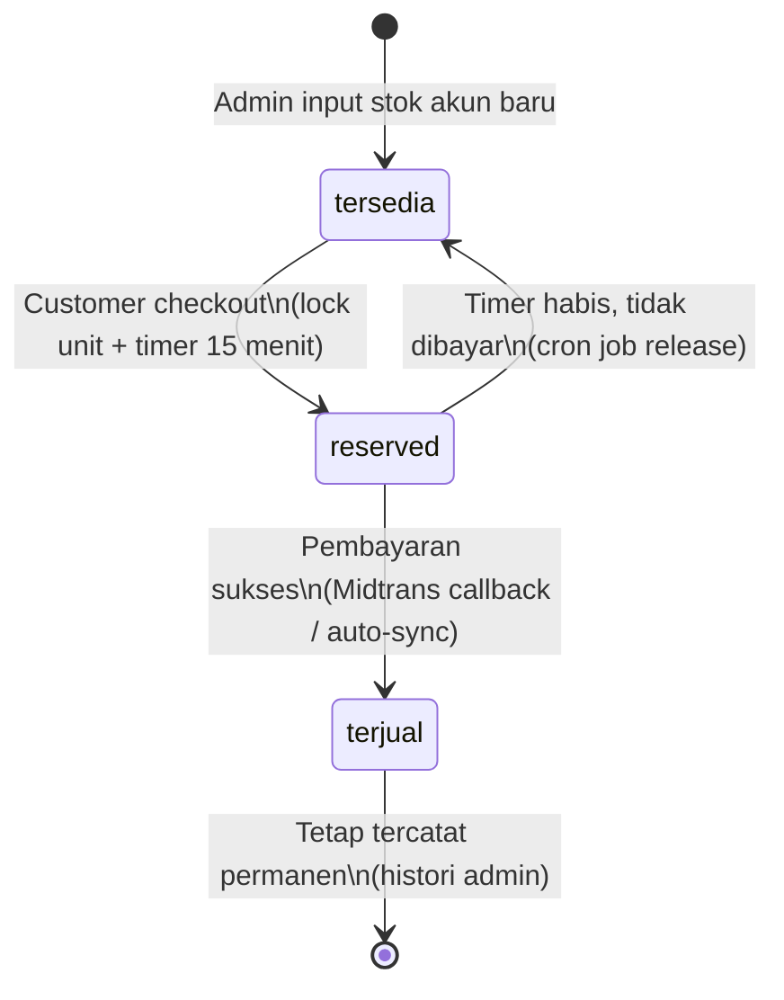
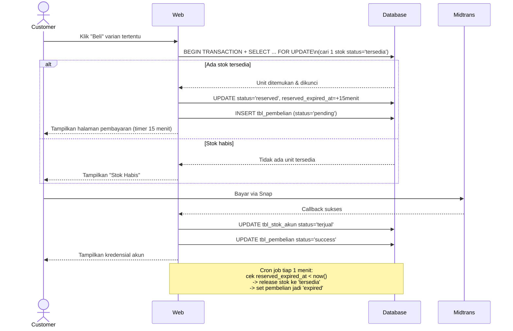

# PRD: Sistem Penjualan Akun Premium (Serialized Stock)

Dokumen ini mendefinisikan struktur database, alur sistem, dan logika kritis untuk platform penjualan akun premium (Spotify, Netflix, dsb) dengan model **stok kredensial individual** — tiap unit akun adalah entitas unik yang dikunci ke satu pembeli.

---

## 1. Konsep & Hierarki

```
Produk (Spotify)
 └─ Tipe Layanan (Private, Sharing, Family, ... — admin bisa tambah bebas)
     └─ Varian/Paket (1 Bulan, 3 Bulan, ... — admin atur harga & durasi)
         └─ Stok Akun (unit kredensial individual: email/username, password, catatan)
```

Poin kunci: **stok bukan atribut angka di level paket, tapi baris-baris individual di tabel terpisah.** Tiap unit dikunci ke satu pembelian dan gak pernah dipakai ulang untuk pembeli lain. Ketika unit terjual, dia hilang dari hitungan "tersedia" yang customer lihat, tapi tetap ada permanen di database untuk histori admin.

---

## 2. Skema Database

### Entity Overview

| Tabel | Fungsi |
|---|---|
| `tbl_produk` | Produk utama (nama app, misal "Spotify") |
| `tbl_tipe_layanan` | Sub-kategori per produk (Private/Sharing/dst), admin-managed |
| `tbl_varian_layanan` | Paket durasi + harga di bawah tiap tipe |
| `tbl_stok_akun` | Unit kredensial individual — jantung sistem |
| `tbl_pembelian` | Transaksi/order |
| `tbl_pembayaran` | Detail pembayaran (mengikuti pola Midtrans yang sudah ada) |

### DDL

```sql
CREATE TABLE tbl_produk (
    id_produk INT UNSIGNED AUTO_INCREMENT PRIMARY KEY,
    nama_produk VARCHAR(100) NOT NULL,
    deskripsi TEXT NULL,
    gambar VARCHAR(255) NULL,
    status ENUM('aktif','nonaktif') NOT NULL DEFAULT 'aktif',
    created_at TIMESTAMP NULL,
    updated_at TIMESTAMP NULL
) ENGINE=InnoDB;

CREATE TABLE tbl_tipe_layanan (
    id_tipe INT UNSIGNED AUTO_INCREMENT PRIMARY KEY,
    id_produk INT UNSIGNED NOT NULL,
    nama_tipe VARCHAR(50) NOT NULL,          -- "Private", "Sharing", "Family", dst (bebas admin)
    status ENUM('aktif','nonaktif') NOT NULL DEFAULT 'aktif',
    created_at TIMESTAMP NULL,
    updated_at TIMESTAMP NULL,
    FOREIGN KEY (id_produk) REFERENCES tbl_produk(id_produk) ON DELETE CASCADE
) ENGINE=InnoDB;

CREATE TABLE tbl_varian_layanan (
    id_varian INT UNSIGNED AUTO_INCREMENT PRIMARY KEY,
    id_tipe INT UNSIGNED NOT NULL,
    nama_varian VARCHAR(50) NOT NULL,        -- "1 Bulan", "3 Bulan"
    durasi_hari INT UNSIGNED NOT NULL,       -- 30, 90, dst (masa aktif langganan utk customer)
    harga DECIMAL(12,2) NOT NULL,
    deskripsi TEXT NULL,
    status ENUM('aktif','nonaktif') NOT NULL DEFAULT 'aktif',
    created_at TIMESTAMP NULL,
    updated_at TIMESTAMP NULL,
    FOREIGN KEY (id_tipe) REFERENCES tbl_tipe_layanan(id_tipe) ON DELETE CASCADE
) ENGINE=InnoDB;

CREATE TABLE tbl_stok_akun (
    id_stok BIGINT UNSIGNED AUTO_INCREMENT PRIMARY KEY,
    id_varian INT UNSIGNED NOT NULL,
    email_username VARCHAR(150) NOT NULL,
    password_encrypted TEXT NOT NULL,        -- WAJIB dienkripsi (Laravel encrypted cast), JANGAN plaintext
    catatan TEXT NULL,
    status ENUM('tersedia','reserved','terjual') NOT NULL DEFAULT 'tersedia',
    id_pembelian BIGINT UNSIGNED NULL,       -- FK ditambahkan setelah tbl_pembelian dibuat (lihat bawah)
    reserved_at TIMESTAMP NULL,
    reserved_expired_at TIMESTAMP NULL,
    tanggal_terjual TIMESTAMP NULL,
    created_at TIMESTAMP NULL,
    updated_at TIMESTAMP NULL,
    FOREIGN KEY (id_varian) REFERENCES tbl_varian_layanan(id_varian) ON DELETE CASCADE,
    INDEX idx_stok_status (id_varian, status)
) ENGINE=InnoDB;

CREATE TABLE tbl_pembelian (
    id_pembelian BIGINT UNSIGNED AUTO_INCREMENT PRIMARY KEY,
    order_id VARCHAR(30) NOT NULL UNIQUE,    -- pakai ULID / prefix+timestamp, JANGAN rand 6 digit (rawan collision)
    id_customer INT UNSIGNED NOT NULL,
    id_varian INT UNSIGNED NOT NULL,
    id_stok BIGINT UNSIGNED NULL,            -- diisi begitu unit direservasi
    harga_saat_beli DECIMAL(12,2) NOT NULL,  -- snapshot harga, jaga2 admin ubah harga nanti
    status ENUM('pending','success','expired','failed','cancelled') NOT NULL DEFAULT 'pending',
    reserved_until TIMESTAMP NULL,
    created_at TIMESTAMP NULL,
    updated_at TIMESTAMP NULL,
    FOREIGN KEY (id_customer) REFERENCES tbl_customer(id_customer),
    FOREIGN KEY (id_varian) REFERENCES tbl_varian_layanan(id_varian),
    FOREIGN KEY (id_stok) REFERENCES tbl_stok_akun(id_stok)
) ENGINE=InnoDB;

-- FK circular: tbl_stok_akun.id_pembelian baru bisa ditambahkan setelah tbl_pembelian ada
ALTER TABLE tbl_stok_akun
    ADD CONSTRAINT fk_stok_pembelian FOREIGN KEY (id_pembelian) REFERENCES tbl_pembelian(id_pembelian);

CREATE TABLE tbl_pembayaran (
    id_pembayaran BIGINT UNSIGNED AUTO_INCREMENT PRIMARY KEY,
    id_pembelian BIGINT UNSIGNED NOT NULL,
    metode_pembayaran VARCHAR(50) NULL,
    jumlah_dibayar DECIMAL(12,2) NOT NULL,
    midtrans_transaction_id VARCHAR(100) NULL,
    tanggal_bayar TIMESTAMP NULL,
    created_at TIMESTAMP NULL,
    updated_at TIMESTAMP NULL,
    FOREIGN KEY (id_pembelian) REFERENCES tbl_pembelian(id_pembelian) ON DELETE CASCADE
) ENGINE=InnoDB;
```

---

## 3. Alur Sistem





---

## 4. Logika Kritis

### 4.1 Reservasi Atomik (Wajib Row Locking)

Tanpa locking, dua customer yang checkout barengan pas stok tinggal 1 bisa sama-sama lolos pengecekan `stok > 0`. Harus pakai transaction + `lockForUpdate`:

```php
DB::transaction(function () use ($id_varian, $id_customer) {
    $stok = StokAkun::where('id_varian', $id_varian)
        ->where('status', 'tersedia')
        ->orderBy('created_at', 'asc')   // FIFO
        ->lockForUpdate()
        ->first();

    if (!$stok) {
        throw new StokHabisException();
    }

    $stok->update([
        'status' => 'reserved',
        'reserved_at' => now(),
        'reserved_expired_at' => now()->addMinutes(15),
    ]);

    $pembelian = Pembelian::create([
        'order_id' => (string) Str::ulid(),
        'id_customer' => $id_customer,
        'id_varian' => $id_varian,
        'id_stok' => $stok->id_stok,
        'harga_saat_beli' => $stok->varian->harga,
        'status' => 'pending',
        'reserved_until' => $stok->reserved_expired_at,
    ]);

    $stok->update(['id_pembelian' => $pembelian->id_pembelian]);
});
```

### 4.2 Cron Job Pelepasan Reservasi

Wajib ada scheduled task, kalau tidak, unit yang di-checkout tapi tidak dibayar akan nyangkut permanen di status `reserved` dan gak pernah bisa dijual lagi.

```php
// app/Console/Kernel.php -> schedule()
$schedule->call(function () {
    $expired = StokAkun::where('status', 'reserved')
        ->where('reserved_expired_at', '<', now())
        ->get();

    foreach ($expired as $stok) {
        DB::transaction(function () use ($stok) {
            $idPembelian = $stok->id_pembelian;

            $stok->update([
                'status' => 'tersedia',
                'reserved_at' => null,
                'reserved_expired_at' => null,
                'id_pembelian' => null,
            ]);

            Pembelian::where('id_pembelian', $idPembelian)
                ->where('status', 'pending')
                ->update(['status' => 'expired']);
        });
    }
})->everyMinute();
```

### 4.3 Edge Case: Pembayaran Sukses Setelah Reservasi Expired

Skenario: customer bayar tepat di detik-detik akhir, tapi cron job sudah keburu melepas unit ke pool sebelum callback Midtrans masuk. Ini butuh keputusan eksplisit, bukan dibiarkan:

- **Cek dulu**: apakah `id_stok` yang tercatat di `tbl_pembelian` masih berstatus `reserved` dan belum diambil order lain? Kalau ya → aman, langsung set `terjual`, ini cuma race kecil di waktu, tidak ada kerugian.
- **Kalau unit itu sudah diambil order lain** (kasus jarang tapi mungkin): sistem harus otomatis coba assign unit lain yang `tersedia` di varian yang sama. Kalau ada → assign & lanjut proses seperti biasa. Kalau tidak ada stok sama sekali → **jangan diam-diam gagalkan**, tandai pembelian sebagai `success` tapi flag khusus butuh resolusi admin (refund atau restock manual), dan kirim notifikasi ke admin. Duit customer sudah masuk, jadi ini tidak boleh berakhir jadi order yang hilang begitu saja.

### 4.4 Keamanan Kredensial

`password_encrypted` di `tbl_stok_akun` **harus** pakai encrypted cast Laravel (`'password_encrypted' => 'encrypted'` di model), bukan disimpan plaintext. Alasannya: tabel ini menyimpan kredensial akun asli secara permanen (termasuk yang sudah terjual, sesuai kebutuhan histori lo) — kalau database ini bocor, semua akun premium yang pernah dijual langsung ter-expose sekaligus. Ini beda dari password user sistem sendiri (yang di-hash satu arah); ini kredensial pihak ketiga yang perlu bisa didekripsi kembali untuk ditampilkan ke pembeli, jadi encrypted (bukan hashed) adalah pilihan yang tepat.

### 4.5 Tampilan Stok

```sql
SELECT COUNT(*) FROM tbl_stok_akun
WHERE id_varian = :id_varian AND status = 'tersedia';
```

Pastikan unit berstatus `reserved` **tidak ikut terhitung** — karena itu sedang ditahan untuk pembeli lain, meski belum tentu jadi terjual.

---

## 5. Ringkasan Keputusan Desain

| Keputusan | Pilihan |
|---|---|
| Tipe layanan | Dinamis, admin bisa tambah per produk |
| Waktu lock stok | Saat checkout (reserved, timeout 15 menit) |
| Tampilan stok | Angka pasti |
| Order ID | ULID (bukan `rand()` 6 digit) |
| Password kredensial | Terenkripsi (Laravel encrypted cast) |
