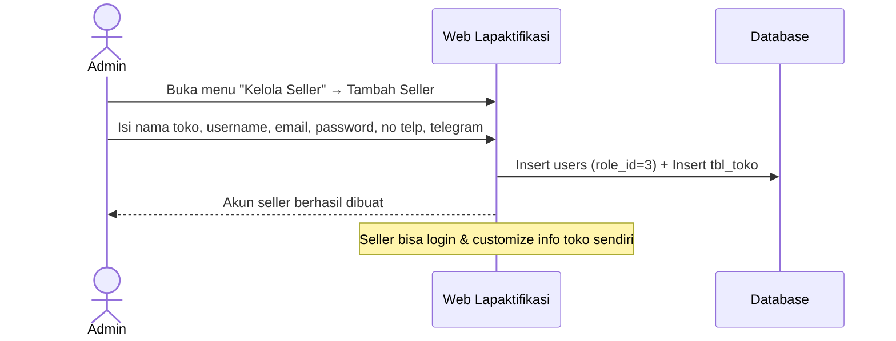
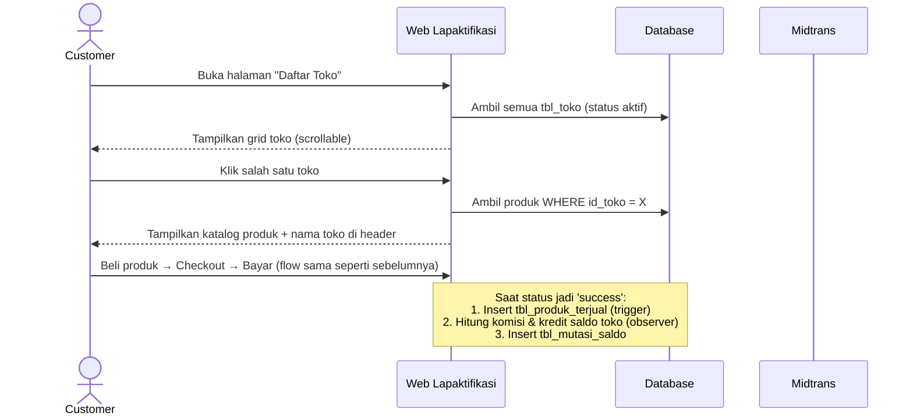
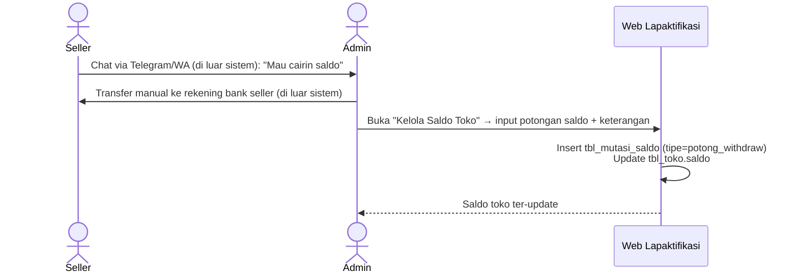
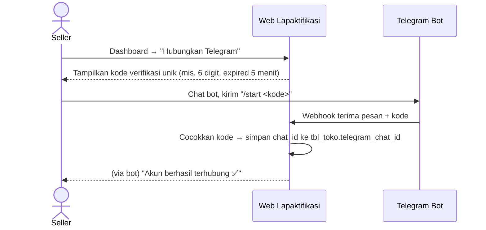

# PRD: Transformasi Lapaktifikasi → Multi-Seller Marketplace

Dokumen ini adalah spesifikasi perubahan dari platform **Lapaktifikasi** (single-seller: hanya Admin & Customer) menjadi **marketplace multi-seller ala Shopee** (Admin, Seller, Customer). Disusun berdasarkan dokumentasi fitur existing + hasil diskusi kebutuhan bisnis.

---

## 1. Latar Belakang

Saat ini Lapaktifikasi hanya punya 1 "toko" yang dikelola Admin. Semua produk, katalog, dan laporan penjualan terpusat di 1 entitas. Target baru: banyak toko (seller) berjualan di 1 platform, customer bisa browse per toko, dan admin jadi pengelola platform (bukan penjual tunggal lagi).

---

## 2. Roles & Permissions (Update)

| Role | role_id | Kewenangan |
|---|---|---|
| **Admin** | 1 | Kelola seluruh platform: buat/nonaktifkan akun seller, atur komisi (global & per-seller), atur/koreksi saldo seller, lihat laporan lintas-toko, moderasi produk jika perlu |
| **Seller** (baru) | 3 | Kelola toko sendiri: edit info toko, CRUD produk (scoped ke toko sendiri), lihat riwayat penjualan & saldo toko sendiri |
| **Customer** | 2 | Browse daftar toko → browse produk per toko → beli → riwayat pembelian (tetap sama seperti sebelumnya) |

> Catatan: alur registrasi mandiri (self sign-up + Google OAuth) **tetap hanya untuk Customer**. Seller **tidak bisa** daftar sendiri — akun seller 100% dibuatkan oleh Admin.

---

## 3. Asumsi & Keputusan Desain

Beberapa hal ini gue asumsikan wajar berdasarkan konteks, tolong dikoreksi kalau salah:

1. **Admin tidak lagi berjualan langsung** — Admin murni pengelola platform, semua produk terikat ke sebuah toko (seller). Kalau ternyata Admin masih mau punya toko sendiri juga, tinggal bikin 1 record `tbl_toko` khusus milik akun admin (schema-nya sudah mendukung ini tanpa perubahan).
2. **Password awal seller** dibuat manual oleh admin saat create akun. Direkomendasikan seller **wajib ganti password** di login pertama (flag `must_change_password`) — opsional, kasih tau kalau mau di-skip.
3. **Seller bisa custom sendiri**: nama toko (mungkin), no. telp, telegram, informasi toko, logo — setelah akun dibuatkan admin.
4. **Produk dikelola oleh seller sendiri** (bukan admin lagi) — CRUD produk scoped ke `id_toko` milik seller yang login.
5. **Komisi**: ada nilai default global (di-set admin), dan bisa di-override per toko (nullable → kalau null pakai default global). Bisa 0% (gratis).
6. **Saldo seller cuma pencatatan (ledger)** — tidak ada integrasi withdraw otomatis ke bank. Alurnya: seller chat admin (WA/Telegram di luar sistem) → admin transfer manual → admin input pengurangan saldo di sistem.

---

## 4. Perubahan Skema Database (DDL)

### 4.1 Tabel Baru: `tbl_toko`
Representasi toko milik seller.

```sql
CREATE TABLE tbl_toko (
    id_toko BIGINT UNSIGNED AUTO_INCREMENT PRIMARY KEY,
    user_id BIGINT UNSIGNED NOT NULL,          -- FK ke users, akun login seller
    nama_toko VARCHAR(150) NOT NULL,
    no_telp VARCHAR(20) NOT NULL,               -- wajib diisi
    akun_telegram VARCHAR(100) NOT NULL,        -- wajib diisi (username, buat ditampilkan ke customer)
    telegram_chat_id VARCHAR(50) NULL,          -- diisi otomatis setelah seller link via bot (/start + kode)
    informasi_toko TEXT NULL,                   -- deskripsi/kontak tambahan
    logo_toko VARCHAR(255) NULL,
    komisi_override DECIMAL(5,2) NULL,          -- persen. NULL = pakai default global
    saldo BIGINT UNSIGNED NOT NULL DEFAULT 0,   -- saldo berjalan (visual/ledger)
    status ENUM('aktif','nonaktif') NOT NULL DEFAULT 'aktif',
    created_at TIMESTAMP NULL,
    updated_at TIMESTAMP NULL,
    FOREIGN KEY (user_id) REFERENCES users(id)
);
```

### 4.2 Tabel `users` — tambah role Seller
```sql
-- role_id existing: 1 = Admin, 2 = Customer
-- tambahkan konvensi: 3 = Seller
-- (tidak perlu ALTER kalau kolom role_id sudah fleksibel/integer)
ALTER TABLE users ADD COLUMN must_change_password BOOLEAN NOT NULL DEFAULT FALSE;
```

### 4.3 Tabel `tbl_produk` — tambah kepemilikan toko
```sql
ALTER TABLE tbl_produk
    ADD COLUMN id_toko BIGINT UNSIGNED NOT NULL AFTER id_produk,
    ADD FOREIGN KEY (id_toko) REFERENCES tbl_toko(id_toko);
```

### 4.4 Tabel `tbl_beli_produk` — denormalisasi toko untuk query cepat
```sql
ALTER TABLE tbl_beli_produk
    ADD COLUMN id_toko BIGINT UNSIGNED NOT NULL AFTER id_produk,
    ADD FOREIGN KEY (id_toko) REFERENCES tbl_toko(id_toko);
```
> Ditambahkan biar query riwayat pembelian & laporan per-toko gak perlu join berlapis. Data kontak toko (no telp/telegram) tetap **live join** ke `tbl_toko` — bukan snapshot — supaya kalau seller ganti nomor, histori lama tetap nunjukin kontak yang aktif sekarang.

### 4.5 Tabel Baru: `tbl_setting_komisi`
Setting komisi default platform (single row/config).

```sql
CREATE TABLE tbl_setting_komisi (
    id BIGINT UNSIGNED AUTO_INCREMENT PRIMARY KEY,
    komisi_default DECIMAL(5,2) NOT NULL DEFAULT 10.00, -- persen
    updated_at TIMESTAMP NULL
);
```

### 4.6 Tabel Baru: `tbl_mutasi_saldo`
Ledger/histori pergerakan saldo tiap toko — buat transparansi & audit trail.

```sql
CREATE TABLE tbl_mutasi_saldo (
    id BIGINT UNSIGNED AUTO_INCREMENT PRIMARY KEY,
    id_toko BIGINT UNSIGNED NOT NULL,
    tipe ENUM('kredit_penjualan','potong_withdraw','penyesuaian_admin') NOT NULL,
    nominal BIGINT NOT NULL,               -- positif (kredit) atau negatif (potongan)
    saldo_akhir BIGINT UNSIGNED NOT NULL,  -- saldo toko setelah mutasi ini
    keterangan VARCHAR(255) NULL,          -- contoh: "Order #123456" / "Withdraw - transfer BCA"
    id_beli_produk BIGINT UNSIGNED NULL,   -- diisi kalau tipe = kredit_penjualan
    dibuat_oleh BIGINT UNSIGNED NULL,      -- user_id admin, diisi kalau mutasi manual
    created_at TIMESTAMP NULL,
    FOREIGN KEY (id_toko) REFERENCES tbl_toko(id_toko),
    FOREIGN KEY (id_beli_produk) REFERENCES tbl_beli_produk(id)
);
```

### 4.7 Perubahan Logika Trigger Penjualan
Trigger lama `after_update_tbl_beli_produk` (pending → success) cuma nambah data ke `tbl_produk_terjual`. Sekarang butuh **kalkulasi komisi kondisional** (cek `komisi_override` toko, fallback ke `komisi_default`), jadi:

> **Rekomendasi teknis**: pindahkan logic ini dari DB trigger murni ke **Laravel Model Observer / Event Listener** pada event update status `tbl_beli_produk`. Alasannya: kalkulasi komisi butuh conditional logic (cek override vs default) yang lebih gampang ditulis, di-test, dan di-maintain di PHP dibanding di trigger SQL. Trigger DB tetap bisa dipertahankan khusus buat `tbl_produk_terjual` (sudah simpel & murni insert).

Alur observer saat status berubah ke `'success'`:
1. Ambil `id_toko` dari order
2. Ambil komisi efektif: `komisi_override` toko tsb, kalau `NULL` pakai `komisi_default`
3. Hitung: `nominal_masuk = harga_produk - (harga_produk * komisi_efektif / 100)`
4. Insert ke `tbl_mutasi_saldo` (`tipe = 'kredit_penjualan'`), update `tbl_toko.saldo`

---

## 5. Alur Sistem (Updated)

### 5.1 Admin Membuat Akun Seller


### 5.2 Customer Browse Toko → Beli Produk


### 5.3 Riwayat Pembelian Customer (Update Tampilan)
Kolom tabel riwayat pembelian:

| No | Order ID | Produk | **Nama Toko / No. Telp Toko** | Harga Beli | Status | Aksi |
|---|---|---|---|---|---|---|

> "Nama Toko" & "No. Telp Toko" ditampilkan dalam 1 sel (nama di atas, no telp di bawah), diambil via join **live** ke `tbl_toko` (bukan snapshot saat order dibuat).

### 5.4 Withdrawal Saldo Seller (Manual)


### 5.5 Notifikasi Seller (Email + Telegram Bot)

Notifikasi dikirim ke seller pada 2 event:
- **Penjualan baru sukses** (setelah komisi dihitung & saldo dikredit)
- **Saldo dipotong** (withdraw manual / penyesuaian oleh admin)

**Kendala teknis penting**: Telegram Bot API cuma bisa kirim pesan pakai `chat_id`, bukan username (`akun_telegram` yang diisi saat toko dibuat cuma buat ditampilkan sebagai info kontak, belum bisa dipakai bot buat kirim pesan). Jadi perlu proses "link akun" dulu:



Setelah `telegram_chat_id` terisi, notifikasi otomatis terkirim ke 2 channel tiap ada event di atas. Kalau seller belum link Telegram, notifikasi tetap jalan lewat email saja (Telegram di-skip, bukan error).

---

## 6. Perubahan Halaman (UI)

| Halaman | Perubahan |
|---|---|
| **Daftar Toko** (baru) | Grid card nama toko (scrollable), klik → masuk katalog toko |
| **Katalog Produk per Toko** | Sama seperti existing, header ditambah "Nama Toko" |
| **Riwayat Pembelian (Customer)** | Tambah kolom Nama Toko + No. Telp Toko |
| **Kelola Seller** (Admin, baru) | List seller, tambah/edit/nonaktifkan akun seller |
| **Setting Komisi** (Admin, baru) | Atur komisi default global + override per toko |
| **Kelola Saldo Toko** (Admin, baru) | Lihat saldo & mutasi tiap toko, input potongan withdraw manual |
| **Profil Toko** (Seller, baru) | Edit nama toko, no telp, telegram, info toko, logo |
| **Kelola Produk** (Seller, dipindah dari Admin) | CRUD produk scoped ke toko sendiri |
| **Dashboard Seller** (baru) | Statistik penjualan toko sendiri, saldo berjalan, riwayat mutasi saldo |
| **Hubungkan Telegram** (Seller, baru) | Generate kode verifikasi + instruksi `/start` ke bot, status terhubung/belum |


## 8. Keputusan yang Sudah Dikonfirmasi

- **Admin tidak punya toko default sendiri** — murni pengelola platform. Kalau nanti admin mau jualan juga, tinggal dibuatkan akun seller seperti biasa lewat menu "Kelola Seller".
- **Komisi hanya dalam bentuk persentase** (sesuai skema `DECIMAL(5,2)` di `tbl_setting_komisi` & `tbl_toko.komisi_override`) — tidak ada opsi nominal tetap per transaksi.
- **Notifikasi wajib 2 channel: Email + Telegram Bot**, dikirim saat ada penjualan baru sukses dan saat saldo dipotong (lihat detail di §5.5).