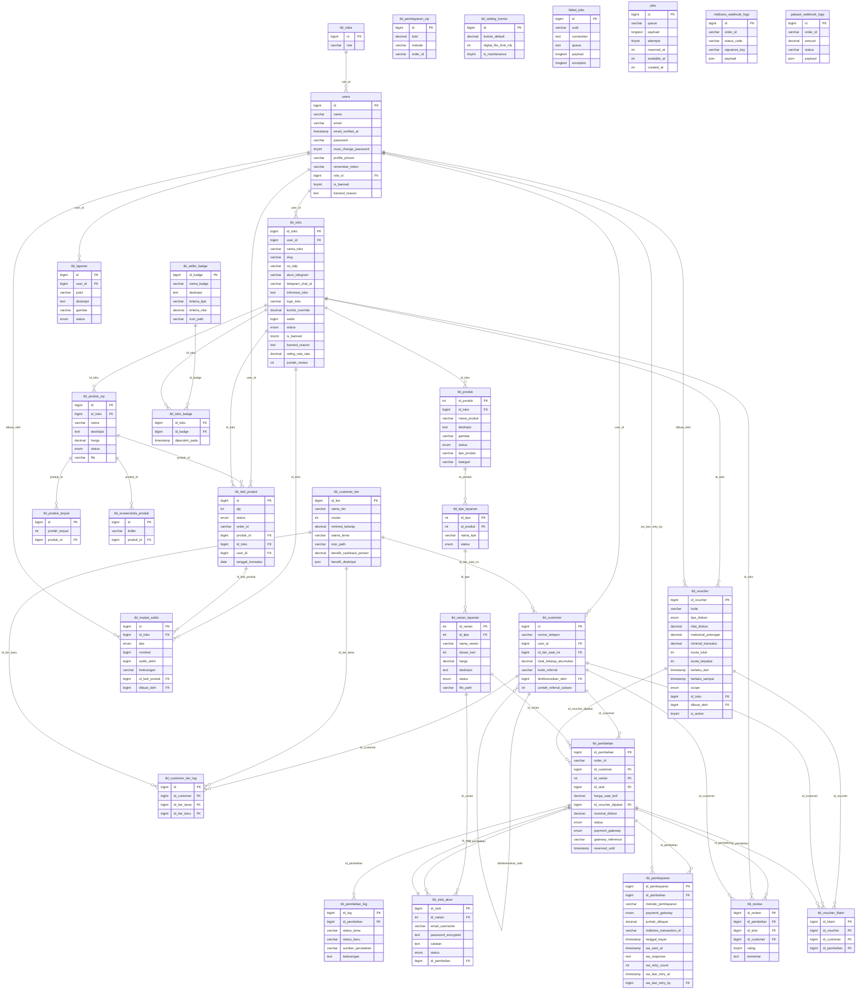

# Entity Relationship Diagram (ERD) - Lapaktifikasi

Dokumen ini berisi Entity Relationship Diagram (ERD) untuk database aplikasi berdasarkan struktur dari file `lapak.sql`. Diagram ini memvisualisasikan seluruh entitas/tabel yang ada beserta relasinya yang didefinisikan menggunakan *Foreign Key* (FK).

## Mermaid Diagram

Berikut adalah diagram ERD dengan detail setiap atribut (kolom) pada setiap tabel beserta tipe datanya:

## Penjelasan Relasi Utama
- **Autentikasi & Akun**: `users` memiliki relasi utama ke `tbl_roles` (peran user), dan setiap user bisa memiliki banyak toko (`tbl_toko`) maupun menjadi pelanggan/customer (`tbl_customer`).
- **Produk & Toko**: Toko dapat membuat banyak produk digital atau layanan (relasi `tbl_toko` ke `tbl_produk` dan `tbl_produk_zip`).
- **Transaksi & Pembelian**: Pembelian melibatkan `tbl_pembelian`, yang menyimpan varian layanan (`tbl_varian_layanan`), menggunakan stok dari akun (`tbl_stok_akun`), dan memiliki alur pembayaran via `tbl_pembayaran`.
- **Fitur Spesial (Tier & Voucher)**: `tbl_customer` bisa berada di `tbl_customer_tier` tertentu dan mendapatkan voucher `tbl_voucher` yang kemudian akan dicatat di `tbl_voucher_klaim` setiap kali digunakan untuk pemesanan.
