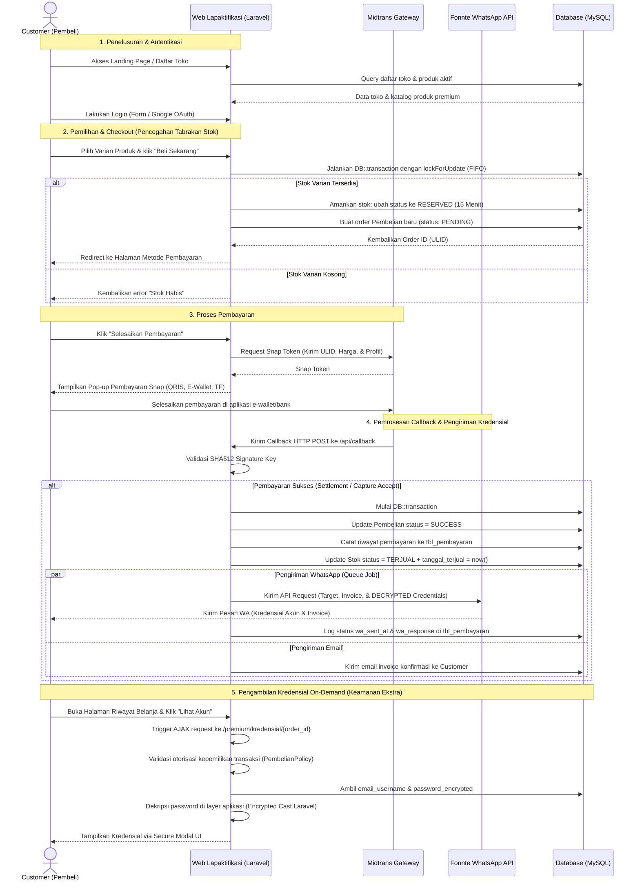

# Analisis Lengkap Fitur, Alur, dan Logika Pembelian Akun Premium - Lapaktifikasi (Tokoku)

Dokumen ini berisi analisis menyeluruh mengenai arsitektur sistem, peran pengguna (*roles*), dan logika operasional dari platform **Lapaktifikasi** (aplikasi marketplace multi-seller khusus akun premium digital seperti Spotify, Netflix, YouTube Premium, dll. menggunakan Laravel, Midtrans Payment Gateway, dan Fonnte WhatsApp API).

---

## 1. Peran Pengguna (Roles & Permissions)

Sistem ini mendukung arsitektur multi-seller yang membagi pengguna ke dalam tiga peran utama berdasarkan kolom `role_id` di database:

| Peran (Role) | ID Peran (`role_id`) | Deskripsi & Hak Akses Utama |
| :--- | :---: | :--- |
| **Admin** | **1** | Pengelola platform secara global. Mampu memoderasi/kelola seller, menonaktifkan toko, mengatur komisi default sistem maupun komisi override per toko, melihat statistik lintas toko, merekam mutasi saldo manual (penarikan/penyesuaian), serta memantau semua status order yang ada di platform. |
| **Customer** | **2** | Pembeli/pengguna akhir. Mampu menjelajahi daftar toko yang aktif, melihat katalog produk premium yang tersedia, melakukan pembelian (dengan checkout dan penguncian stok otomatis), membayar melalui gateway pembayaran Midtrans, menerima notifikasi kredensial instan via WhatsApp/Email, serta mengakses riwayat belanja mereka untuk melihat detail akun terenkripsi secara aman (*decrypt on-demand*). |
| **Seller** | **3** | Pemilik toko. Akun seller dibuat secara manual oleh Admin (tidak ada registrasi mandiri untuk seller). Seller mengelola tokonya sendiri via dashboard seller: mengubah profil toko (nama, deskripsi, WA, Telegram, logo), melakukan CRUD produk premium, tipe layanan, varian harga/durasi, mengunggah kredensial stok akun (baik eceran maupun massal/bulk), memantau histori penjualan tokonya, serta melacak saldo saldo berjalan dari ledger mutasi saldo toko sendiri. |

---

## 2. Alur Pembelian & Logika Sistem (End-to-End Purchase Flow)

Alur transaksi pada platform Lapaktifikasi dari awal kunjungan hingga kredensial akun premium aman di tangan pembeli dirancang dengan memperhatikan aspek keamanan data, skalabilitas penanganan stok, dan otomatisasi pengiriman.

### A. Diagram Alur Transaksi Lengkap


---

## 3. Analisis Logika & Backend Controller Secara Detail

### A. Halaman Utama & Katalog Scoped per Toko
1. **Landing Page**: Diatur pada [welcome.blade.php](file:///c:/Users/iki/Downloads/tokoku-main/tokoku-main/resources/views/welcome.blade.php) yang menampilkan branding, kelebihan platform, statistik global, visi misi, cara kerja 4 langkah mudah, daftar FAQ, serta modal pop-up login bagi pengguna tamu (*guest*).
2. **Daftar Toko**: Customer diarahkan ke route `/daftar_toko` yang memproses listing toko aktif via `ProductController@daftar_toko`.
3. **Katalog Scoped**: Saat customer memilih sebuah toko, mereka akan diarahkan ke route `/toko/{id_toko}/produk` ([ProductController.php:L355](file:///c:/Users/iki/Downloads/tokoku-main/tokoku-main/app/Http/Controllers/ProductController.php#L355)), yang mendelegasikan kueri ke `PremiumCustomerController@katalog` ([PremiumCustomerController.php:L19](file:///c:/Users/iki/Downloads/tokoku-main/tokoku-main/app/Http/Controllers/PremiumCustomerController.php#L19)) dengan parameter `id_toko` guna menampilkan produk premium yang eksklusif hanya dijual oleh toko bersangkutan.

### B. Otentikasi & Registrasi
Sistem otentikasi dikendalikan di [AuthController.php](file:///c:/Users/iki/Downloads/tokoku-main/tokoku-main/app/Http/Controllers/AuthController.php):
*   **Registrasi Customer**: Menggunakan route `/proses_pendaftaran` ([AuthController.php:L126](file:///c:/Users/iki/Downloads/tokoku-main/tokoku-main/app/Http/Controllers/AuthController.php#L126)) dengan validasi kata sandi minimal 10 karakter. Ada logika khusus: jika email yang didaftarkan adalah `g4lihanggoro@gmail.com`, sistem otomatis menetapkan `role_id = 1` (Admin). Jika email lain, ditetapkan `role_id = 2` (Customer) dan otomatis membuat relasi di `tbl_customer`.
*   **Google OAuth**: Menggunakan Laravel Socialite pada `/redirect` dan `/auth/google/callback` ([AuthController.php:L167](file:///c:/Users/iki/Downloads/tokoku-main/tokoku-main/app/Http/Controllers/AuthController.php#L167)) untuk pendaftaran/login sekali klik menggunakan akun Google.
*   **Login & Session**: Melakukan regenerasi session untuk keamanan session fixation dan mengarahkan pengguna berdasarkan perannya: Admin ke dashboard utama, Seller ke dashboard toko, dan Customer ke pengaturan profil mereka.

### C. Logika Reservasi & Penguncian Stok (Checkout)
Ketika Customer mengklik tombol beli untuk varian tertentu, sistem memicu request POST ke `/proses_checkout_premium` ([ProductController.php:L264](file:///c:/Users/iki/Downloads/tokoku-main/tokoku-main/app/Http/Controllers/ProductController.php#L264)):
1.  **Validasi Kelengkapan Profil**: Memastikan pembeli sudah mengisi nama lengkap dan nomor telepon WhatsApp di profilnya. Jika belum, diarahkan kembali ke profil untuk melengkapinya ([ProductController.php:L274](file:///c:/Users/iki/Downloads/tokoku-main/tokoku-main/app/Http/Controllers/ProductController.php#L274)).
2.  **Transaksi Database & Row Lock**:
    *   Jalankan `DB::transaction()` untuk menjamin integritas data (ACID).
    *   Mengambil satu record stok akun dengan kueri:
        ```php
        $stok = \App\Models\StokAkun::where('id_varian', $id_varian)
            ->where('status', \App\Enums\StokStatus::TERSEDIA)
            ->orderBy('created_at', 'asc') // Antrean FIFO (First-In, First-Out)
            ->lockForUpdate() // Row Lock pada baris ini agar tidak dibeli oleh orang lain secara bersamaan
            ->first();
        ```
    *   Jika stok bernilai `null`, lemparkan `StokHabisException` dan gagalkan checkout.
    *   Jika stok tersedia, sistem menyetel reservasi stok selama 15 menit ke depan:
        ```php
        $stok->update([
            'status' => \App\Enums\StokStatus::RESERVED,
            'reserved_at' => now(),
            'reserved_expired_at' => now()->addMinutes(15),
        ]);
        ```
    *   Membuat transaksi pembelian baru di tabel `tbl_pembelian` dengan status awal `PENDING` dan menghasilkan `order_id` unik berbasis ULID (Universally Unique Lexicographically Sortable Identifier) demi kenyamanan sorting serta keamanan penyamaran ID autoincrement.
    *   Menghubungkan `id_pembelian` di tabel `tbl_stok_akun` ke data transaksi pembelian pembeli.

### D. Integrasi Pembayaran & Proteksi Kegagalan Token Midtrans
Alur pembayaran diatur di [PembayaranController.php](file:///c:/Users/iki/Downloads/tokoku-main/tokoku-main/app/Http/Controllers/PembayaranController.php):
1.  **Generate Snap Token**: Route `/metode_pembayaran/{order_id}` ([PembayaranController.php:L174](file:///c:/Users/iki/Downloads/tokoku-main/tokoku-main/app/Http/Controllers/PembayaranController.php#L174)) mengirimkan parameter transaksi (ULID, harga varian, nama, dan no. WA customer) ke Midtrans Snap API untuk memperoleh token pembayaran modal popup.
2.  **Pencegahan Tabrakan Snap Token (Snap Crash Prevention)**:
    Jika customer menutup modal pembayaran sebelum membayar, lalu mengklik "Bayar Kembali" dari riwayat belanja mereka, Midtrans melarang request pembuatan token baru dengan `order_id` yang sama. Sistem menangkap pengecualian (*exception*) tersebut:
    ```php
    try {
        $snapToken = \Midtrans\Snap::getSnapToken($params);
    } catch (\Exception $e) {
        if (str_contains($e->getMessage(), 'has already been taken')) {
            $status = \Midtrans\Transaction::status($orderIdProduk);
            if ($status->transaction_status == 'pending') {
                // Diarahkan secara aman ke riwayat pembayaran dengan info ramah pengguna
                return redirect('/bukti_pembayaran')->with('error', 'Pembayaran sedang ditangguhkan (pending) di Midtrans. Harap selesaikan pembayaran Anda.');
            }
        }
        return redirect('/bukti_pembayaran')->with('error', 'Gagal memproses pembayaran Midtrans: ' . $e->getMessage());
    }
    ```

### E. Penanganan Callback Midtrans & Otomatisasi WhatsApp (Fonnte)
Ketika transaksi diselesaikan oleh pembeli, Midtrans mengirimkan notifikasi HTTP POST ke `/api/callback` ([MidtransController.php:L23](file:///c:/Users/iki/Downloads/tokoku-main/tokoku-main/app/Http/Controllers/MidtransController.php#L23)):
1.  **Validasi Hash Signature**: Sistem memverifikasi validitas payload notifikasi dengan membandingkan hash SHA512 dari `order_id + status_code + gross_amount + serverKey` terhadap signature key yang dikirimkan.
2.  **Sinkronisasi Idempotensi**:
    Sistem mengecek status database. Jika `Pembelian` sudah berstatus `SUCCESS` ([MidtransController.php:L71](file:///c:/Users/iki/Downloads/tokoku-main/tokoku-main/app/Http/Controllers/MidtransController.php#L71)), proses langsung dihentikan untuk menghindari pengiriman kredensial ganda (idempotency safety).
3.  **Prosedur Pembayaran Berhasil**:
    Di dalam transaksi database (`DB::transaction()`):
    *   Mengubah status `tbl_pembelian` menjadi `SUCCESS` dan menghapus tanggal kedaluwarsa reservasi.
    *   Mencatat detail tipe pembayaran, ID transaksi Midtrans, dan nominal ke tabel `tbl_pembayaran`.
    *   Mengubah status `tbl_stok_akun` dari `RESERVED` menjadi `TERJUAL` serta menetapkan `tanggal_terjual = now()`.
    *   **Penyelesaian Masalah Stok Kadaluwarsa Pasca Bayar (Edge Case 4.3)**:
        Jika customer melakukan pembayaran yang sah sesaat setelah reservasi 15 menit berakhir (sehingga status stok telah di-reset oleh sistem menjadi 'tersedia'), callback akan mendeteksi hilangnya tautan stok. Sistem otomatis mengalokasikan stok akun alternatif yang berstatus `TERSEDIA` dari varian yang sama secara FIFO, memperbarui link stok baru, dan menandainya sebagai `TERJUAL`. Jika stok alternatif benar-benar habis, sistem secara otomatis mengirimkan email peringatan darurat ke email Admin (`g4lihanggoro@gmail.com`) untuk penanganan pengiriman manual ([MidtransController.php:L109-L138](file:///c:/Users/iki/Downloads/tokoku-main/tokoku-main/app/Http/Controllers/MidtransController.php#L109)).
4.  **Pengiriman Pesan WhatsApp (Async Queue Job)**:
    Sistem memicu antrean job latar belakang `SendAccountInvoiceWhatsapp::dispatch($pembelian->id_pembelian)` ([MidtransController.php:L142](file:///c:/Users/iki/Downloads/tokoku-main/tokoku-main/app/Http/Controllers/MidtransController.php#L142)):
    *   Di dalam handler job ([SendAccountInvoiceWhatsapp.php:L30](file:///c:/Users/iki/Downloads/tokoku-main/tokoku-main/app/Jobs/SendAccountInvoiceWhatsapp.php#L30)), data kredensial diambil dan password didekripsi menggunakan `Crypt::decryptString()`.
    *   Mengirim data pesan ke target nomor WhatsApp via `FonnteService@sendText` ([FonnteService.php:L16](file:///c:/Users/iki/Downloads/tokoku-main/tokoku-main/app/Services/FonnteService.php#L16)).
    *   Mencatat respons log Fonnte ke kolom `wa_sent_at` dan `wa_response` di database untuk kebutuhan audit pelacakan pengiriman.
5.  **Pengiriman Email Invoice**: Mengirimkan salinan invoice resmi lunas melalui email customer (`MailPremiumBeli`).
6.  **Prosedur Pembayaran Gagal/Kadaluwarsa**:
    Jika Midtrans mengirimkan status transaksi `deny`, `expire`, atau `cancel`:
    *   Mengubah status transaksi di `tbl_pembelian` menjadi `FAILED`/`EXPIRED`.
    *   Melepas kembali baris stok akun di tabel `tbl_stok_akun` dari status `RESERVED` ke `TERSEDIA`, serta mengosongkan tanggal reservasi dan tautan `id_pembelian` agar bisa dibeli customer lain.

### F. Pengambilan Kredensial On-Demand & Keamanan Dekripsi
Untuk menjaga kerahasiaan data pembeli, kredensial akun tidak dirender secara statis di source code HTML halaman riwayat belanja.
1.  Customer membuka halaman `/premium/riwayat` ([PremiumCustomerController.php:L71](file:///c:/Users/iki/Downloads/tokoku-main/tokoku-main/app/Http/Controllers/PremiumCustomerController.php#L71)).
2.  Ketika tombol **"Lihat Akun"** diklik, halaman akan memicu fungsi JavaScript AJAX GET ke `/premium/kredensial/{order_id}` ([PremiumCustomerController.php:L89](file:///c:/Users/iki/Downloads/tokoku-main/tokoku-main/app/Http/Controllers/PremiumCustomerController.php#L89)).
3.  **Otorisasi Otoritas (Policy)**:
    Sistem menerapkan [PembelianPolicy.php](file:///c:/Users/iki/Downloads/tokoku-main/tokoku-main/app/Policies/PembelianPolicy.php) untuk menolak akses jika akun pembeli yang sedang masuk tidak cocok dengan pemilik record order tersebut.
4.  **Dekripsi Otomatis (On-Demand)**:
    Jika data valid dan berstatus `SUCCESS`, model `StokAkun` yang menggunakan cast *encrypted* pada atribut `password_encrypted` ([StokAkun.php:L29](file:///c:/Users/iki/Downloads/tokoku-main/tokoku-main/app/Models/StokAkun.php#L29)) akan secara otomatis mendekripsi data password menggunakan enkripsi AES-256-CBC Laravel. Nilai password mentah (*plaintext*) beserta username dan catatan lalu dikembalikan dalam format JSON untuk ditampilkan pada dialog modal pop-up di browser pembeli.

---

## 4. Mekanisme Otomatisasi Berjadwal (Scheduler)

Untuk membersihkan stok yang tertahan karena pembeli tidak kunjung membayar, sistem memiliki scheduler otomatis pada [Kernel.php](file:///c:/Users/iki/Downloads/tokoku-main/tokoku-main/app/Console/Kernel.php):
*   **Waktu Eksekusi**: Dijalankan setiap menit (`->everyMinute()`).
*   **Logika Operasional**:
    Sistem menyeleksi stok akun di database yang berstatus `RESERVED` namun batas waktu reservasi telah lewat dari waktu saat ini (`reserved_expired_at < now()`).
    Bagi setiap baris stok yang kadaluwarsa, sistem membungkusnya dalam transaksi database untuk:
    1.  Mengembalikan status stok di `tbl_stok_akun` menjadi `TERSEDIA`.
    2.  Menghapus penunjuk waktu reservasi dan memutus relasi `id_pembelian` (diset ke `null`).
    3.  Mengubah status transaksi di `tbl_pembelian` menjadi `EXPIRED` (jika status sebelumnya masih `PENDING`).

---

## 5. Fitur Pengelolaan Multi-Seller

Sistem multi-seller pada Lapaktifikasi menjamin isolasi data yang ketat antara penjual satu dengan lainnya agar rahasia dagang tetap aman.

### A. Dashboard & Pengelolaan Produk bagi Seller
*   **Dasboard Seller**: Mengakses `/seller/dashboard` untuk memantau omzet penjualan hari ini, jumlah order sukses harian, data mutasi saldo berjalan toko, dan riwayat ledger pembayaran ([DashboardController.php:L130](file:///c:/Users/iki/Downloads/tokoku-main/tokoku-main/app/Http/Controllers/DashboardController.php#L130)).
*   **Update Profil Toko**: Mengelola informasi publik toko, nomor WhatsApp, logo toko, dan username Telegram via `/seller/profil` ([SellerTokoController.php](file:///c:/Users/iki/Downloads/tokoku-main/tokoku-main/app/Http/Controllers/SellerTokoController.php)).
*   **CRUD Produk & Relasi**: Mengelola data katalog produk premium scoped ke `id_toko` seller. CRUD tipe layanan dan varian durasi/harga diatur secara modular.
*   **Manajemen Kredensial Stok**:
    *   **Single Input**: Pengunggahan satu per satu kredensial akun digital.
    *   **Bulk Input**: Mempercepat pengunggahan dengan mem-paste baris-baris data kredensial sekaligus dalam format string yang dipisahkan pipa ([PremiumAdminController.php:L308](file:///c:/Users/iki/Downloads/tokoku-main/tokoku-main/app/Http/Controllers/PremiumAdminController.php#L308)):
        `email_atau_username|password_akun|catatan_opsional`
    *   **Dekripsi & Audit**: Memungkinkan seller melihat detail password yang terenkripsi pada stok milik tokonya sendiri melalui route `/premium/stok/detail/{id}`.
*   **Isolasi Keamanan Data (Guards & Scope Protection)**:
    Setiap query baca/tulis di `PremiumAdminController` menerapkan filter berbasis `id_toko` milik seller yang sedang terotentikasi. Contoh pengecekan pada input stok:
    ```php
    $toko = Toko::where('user_id', Auth::id())->firstOrFail();
    $varian = VarianLayanan::where('id_varian', $request->id_varian)
        ->whereHas('tipeLayanan.produk', function($q) use ($toko) {
            $q->where('id_toko', $toko->id_toko); // ← Membatasi agar hanya bisa menambah stok pada varian miliknya
        })->first();
    if (!$varian) abort(403, 'Unauthorized access.');
    ```

### B. Pengawasan Toko bagi Admin
*   **Kelola Akun Penjual**: Admin membuat dan mendaftarkan akun seller baru via `/kelola_seller` ([KelolaSellerController.php](file:///c:/Users/iki/Downloads/tokoku-main/tokoku-main/app/Http/Controllers/KelolaSellerController.php)). Sistem otomatis menandai flag `must_change_password = true` pada akun seller baru tersebut, sehingga ketika seller masuk pertama kali, mereka dipaksa memperbarui password default demi aspek keamanan. Admin juga dapat memblokir/mengubah status toko menjadi non-aktif sewaktu-waktu.
*   **Skema Komisi Fleksibel**: Admin menetapkan persentase komisi platform default (misal 10%) di tabel `tbl_setting_komisi`. Namun, Admin dapat memberlakukan persen khusus (*override*) yang berbeda untuk masing-masing toko (di-set nullable di `tbl_toko.komisi_override`).
*   **Pencatatan Ledger Saldo Manual**: Keuangan seller tercatat secara manual. Alurnya: Seller mengajukan penarikan dana di luar sistem → Admin mentransfer dana melalui rekening bank → Admin mencatat transaksi pengurangan saldo di halaman `/saldo_toko` ([SaldoTokoController.php:L48](file:///c:/Users/iki/Downloads/tokoku-main/tokoku-main/app/Http/Controllers/SaldoTokoController.php#L48)) dengan memilih tipe mutasi `potong_withdraw`.
*   **Notifikasi Telegram Bot (Rencana & Skema Database)**:
    Database menyediakan kolom `akun_telegram` and `telegram_chat_id` di `tbl_toko` untuk integrasi notifikasi chat bot otomatis. Pada skema yang didesain, seller mendaftarkan bot dengan mengirim perintah `/start <kode_verifikasi>` untuk mencatat `chat_id` unik mereka. Notifikasi instan akan secara otomatis dikirimkan ke Telegram seller saat terdapat penjualan sukses baru atau saat saldo dipotong oleh Admin.

---

## 6. Struktur Schema Database & Hubungan Relasi Data

Berikut adalah relasi tabel-tabel utama yang mengelola logika pembelian akun premium di platform Lapaktifikasi:

```
+--------------------+
|     tbl_toko       |
+--------------------+
| id_toko (PK)       |
| user_id (FK)       | <---+ Relasi ke tabel `users` (Seller Account)
| nama_toko          |
| saldo              |
| komisi_override    |
+--------------------+
          | 1
          |
          | N
+--------------------+
|    tbl_produk      |
+--------------------+
| id_produk (PK)     |
| id_toko (FK)       | <---+ Menghubungkan produk ke toko asal
| nama_produk        |
| tipe_produk        | ---> (Hanya bernilai 'premium')
+--------------------+
          | 1
          |
          | N
+--------------------+
| tbl_tipe_layanan   |
+--------------------+
| id_tipe (PK)       |
| id_produk (FK)     | <---+ Pengelompokan tipe akun (Private/Sharing)
| nama_tipe          |
+--------------------+
          | 1
          |
          | N
+--------------------+
| tbl_varian_layanan |
+--------------------+
| id_varian (PK)     |
| id_tipe (FK)       | <---+ Durasi & harga paket layanan (1 Bulan, 3 Bulan)
| nama_varian        |
| harga              |
| durasi_hari        |
+--------------------+
          | 1          +--------------------+
          |            |    tbl_customer    |
          |            +--------------------+
          |            | id (PK)            |
          |            | user_id (FK)       | <---+ Relasi ke tabel `users` (Customer Account)
          |            | nomor_telepon      | ---> (Target WA Fonnte Invoice)
          |            +--------------------+
          |                      | 1
          |                      |
          +----------+           | N
                     |           |
                     v           v
               +--------------------+
               |    tbl_pembelian   |
               +--------------------+
               | id_pembelian (PK)  |
               | order_id (ULID)    |
               | id_customer (FK)   | <---+ Hubungan pembeli transaksi
               | id_varian (FK)     | <---+ Hubungan paket yang dibeli
               | id_stok (FK)       | <---+ Relasi slot stok yang dipesan
               | harga_saat_beli    |
               | status             | ---> (pending, success, expired, failed)
               +--------------------+
                         | 1
                         |
                         | N (Sebenarnya 1:1, dibuat 1:N untuk riwayat pembayaran)
               +--------------------+
               |   tbl_pembayaran   |
               +--------------------+
               | id_pembayaran (PK) |
               | id_pembelian (FK)  | <---+ Detail transaksi Midtrans
               | metode_pembayaran  |
               | wa_sent_at         | ---> (Timestamp status terkirim Fonnte WA)
               | wa_response        | ---> (Payload log respons Fonnte API)
               +--------------------+
```
