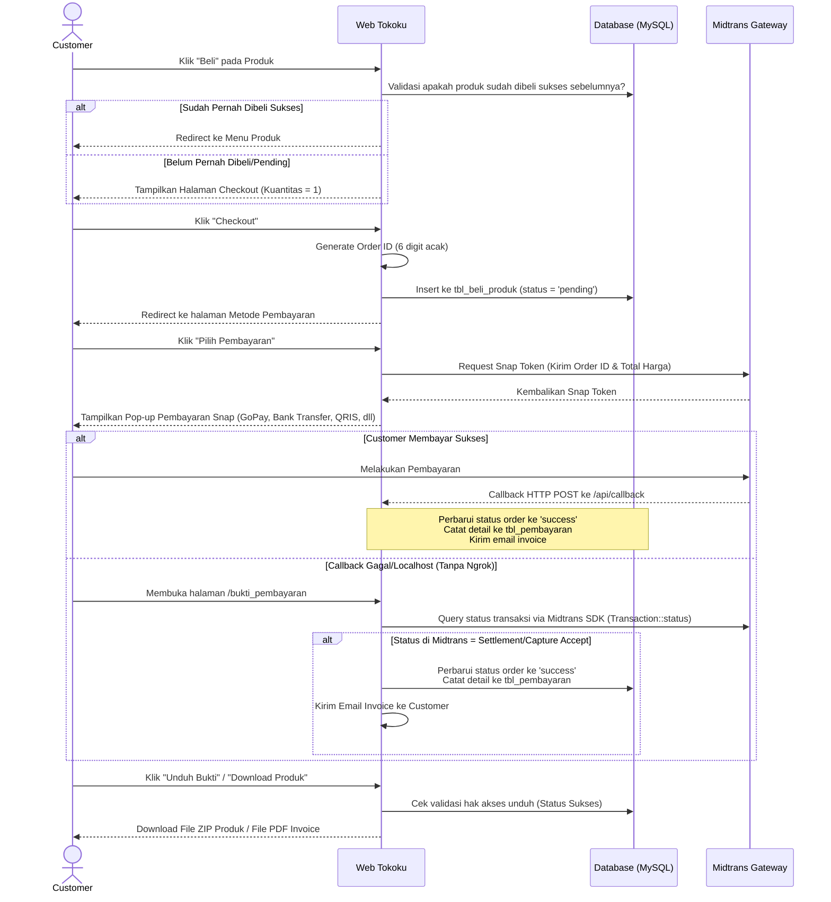

# Dokumentasi Fitur, Alur, dan Logika Pembelian Tokoku

Dokumen ini berisi analisis lengkap mengenai seluruh fitur, peran pengguna (roles), alur sistem, serta logika pembelian barang di platform **Tokoku** (aplikasi penjualan produk digital/source code menggunakan Laravel & Midtrans).

---

## 1. Peran Pengguna (Roles & Permissions)

Sistem ini memiliki dua peran utama yang dibedakan berdasarkan kolom `role_id` di database:

*   **Admin (Role ID: 1)**:
    *   Mengelola katalog produk (Tambah, Edit, Hapus data dan file ZIP produk).
    *   Mengunggah dan mengekstrak galeri tangkapan layar (*screenshots*) untuk detail produk.
    *   Melihat dashboard statistik penjualan harian.
    *   Melihat laporan analisis produk terjual.
*   **Customer (Role ID: 2)**:
    *   Menjelajahi menu produk digital.
    *   Melihat galeri detail produk (*screenshots*).
    *   Melakukan pemesanan dan pembayaran produk via Midtrans.
    *   Mengunduh file ZIP produk digital yang telah dibeli secara sukses.
    *   Melihat histori pembayaran dan mengunduh bukti pembayaran (Invoice PDF).
    *   Mengelola profil pribadi (Nama & Nomor Telepon) dan mengganti kata sandi.

---

## 2. Fitur-Fitur Utama Sistem

### A. Autentikasi & Keamanan (Authentication)
1.  **Registrasi Mandiri (Sign Up)**: Pendaftaran akun baru menggunakan email dan password (minimal 10 karakter).
    *   *Catatan Logic*: Jika mendaftar dengan email khusus `g4lihanggoro@gmail.com`, otomatis mendapatkan peran Admin (`role_id: 1`). Pendaftaran dengan email lain otomatis mendapatkan peran Customer (`role_id: 2`) beserta pembuatan record di tabel `tbl_customer`.
2.  **Login Akun**: Autentikasi email dan password menggunakan Laravel Auth Session dengan fitur *Remember Me*.
3.  **Google Single Sign-On (OAuth)**: Integrasi dengan Google OAuth via Laravel Socialite untuk login atau pendaftaran otomatis secara instan.
4.  **Reset Password**: Pengiriman link reset kata sandi ke email pengguna apabila lupa kata sandi.

### B. Manajemen Produk (Admin Only)
1.  **Katalog Produk CRUD**:
    *   **Create**: Unggah produk baru berupa file ZIP source code/aplikasi beserta nama, deskripsi, harga, dan status ketersediaan.
    *   **Read**: Menampilkan semua produk di database.
    *   **Update**: Memperbarui informasi produk dan memperbarui file ZIP produk (menghapus file lama).
    *   **Delete**: Menghapus data produk dari database sekaligus menghapus file ZIP produk secara permanen dari server.
2.  **Ekstraksi Tangkapan Layar (Screenshots Extraction)**:
    *   Admin mengunggah file ZIP berisi gambar screenshots produk.
    *   Sistem mengekstrak file ZIP tersebut secara otomatis ke direktori `public/assets/extract_[nama_zip]_[timestamp]`, kemudian mencatat nama folder tersebut ke tabel `tbl_screenshots_produk`.

### C. Profil & Pengaturan Akun (Customer & Admin)
1.  **Ganti Password**: Memperbarui password lama dengan password baru (minimal 10 karakter) disertai konfirmasi kecocokan password.
2.  **Update Profile (Customer)**: Mengubah nama lengkap dan nomor telepon. Validasi mencegah perubahan email ke email lain.

### D. Statistik & Pelaporan (Admin Only)
1.  **Dashboard Utama**:
    *   Menampilkan jumlah order sukses yang terjadi hari ini.
    *   Menampilkan total omzet/penjualan hari ini (dalam format Rupiah).
    *   Menampilkan total jumlah barang yang terjual hari ini.
    *   Menampilkan daftar nama customer yang melakukan pemesanan hari ini.
2.  **Laporan Produk Terjual**: Menampilkan daftar produk yang telah terjual setidaknya 1 kali beserta akumulasi jumlah kuantitas yang terjual.

---

## 3. Alur dan Logika Pembelian Produk (Purchase Flow)

Alur pembelian produk digital pada Tokoku dirancang dengan integrasi **Midtrans Snap API** dan database sinkronisasi otomatis.

### A. Diagram Alur Transaksi

### B. Penjelasan Detail Logika Program

1.  **Pencegahan Pembelian Ganda**:
    Sebelum halaman beli/checkout ditampilkan, program memeriksa tabel `tbl_beli_produk` untuk memverifikasi apakah Customer bersangkutan sudah memiliki transaksi berstatus `'success'` untuk produk tersebut. Jika sudah, customer diblokir dari pembelian ulang produk yang sama.
2.  **Pembuatan Order (Checkout)**:
    *   Kuantitas produk dibatasi maksimal `1` unit (karena merupakan produk digital).
    *   `order_id` dibuat secara acak sebanyak 6 digit menggunakan fungsi `rand(100000, 999999)`.
    *   Transaksi awal disimpan di tabel `tbl_beli_produk` dengan status `'pending'`.
3.  **Integrasi Snap Token**:
    Sistem mengirimkan data barang, harga, nama customer, nomor telepon, dan `order_id` unik ke Midtrans untuk mendapatkan `snapToken` yang digunakan oleh pustaka Javascript Snap (`snap.js`) di frontend untuk merender modal pilihan pembayaran.
4.  **Penanganan Tabrakan ID Transaksi (Snap Token Crash Prevention)**:
    Jika user menutup popup Snap sebelum membayar, lalu mengklik "Selesaikan Pembayaran" kembali:
    *   Midtrans melarang request `getSnapToken` dengan `order_id` yang sama.
    *   Sistem menangkap exception kegagalan pembuatan token Snap.
    *   Sistem melakukan cek status ke Midtrans. Jika statusnya `'pending'`, sistem langsung mengarahkan user kembali ke halaman invoice dengan pesan instruksi pembayaran ramah ("Pembayaran sedang ditangguhkan di Midtrans..."), menghindari crash aplikasi.
5.  **Sinkronisasi Status Otomatis (Auto-Sync)**:
    Jika notifikasi callback dari Midtrans terhambat (karena berjalan di localhost/tanpa Ngrok):
    *   Setiap kali halaman **Bukti Pembayaran** dimuat atau halaman **Metode Pembayaran** diakses, sistem secara proaktif menanyakan status `order_id` yang bersangkutan langsung ke server Midtrans melalui API `\Midtrans\Transaction::status($order_id)`.
    *   Apabila Midtrans merespon transaksi tersebut telah lunas (`settlement` / `capture` dengan `accept`), sistem secara otomatis memicu query lokal untuk memperbarui status transaksi menjadi `'success'`, membuat record pembayaran, dan mengirimkan email konfirmasi.
6.  **Database Trigger Penjualan**:
    Database memiliki trigger `after_update_tbl_beli_produk` pada tabel `tbl_beli_produk`. Ketika status berubah dari `'pending'` ke `'success'`, trigger ini secara otomatis menginput data kuantitas barang ke tabel `tbl_produk_terjual` untuk analisis penjualan.
7.  **Keamanan Unduhan (Download Security)**:
    Route `/download_produk/{id_produk}` dilindungi pengecekan kepemilikan. File ZIP produk hanya dapat diunduh jika `tbl_beli_produk` mencatat transaksi `'success'` atas nama pengguna tersebut untuk ID produk yang bersangkutan.
