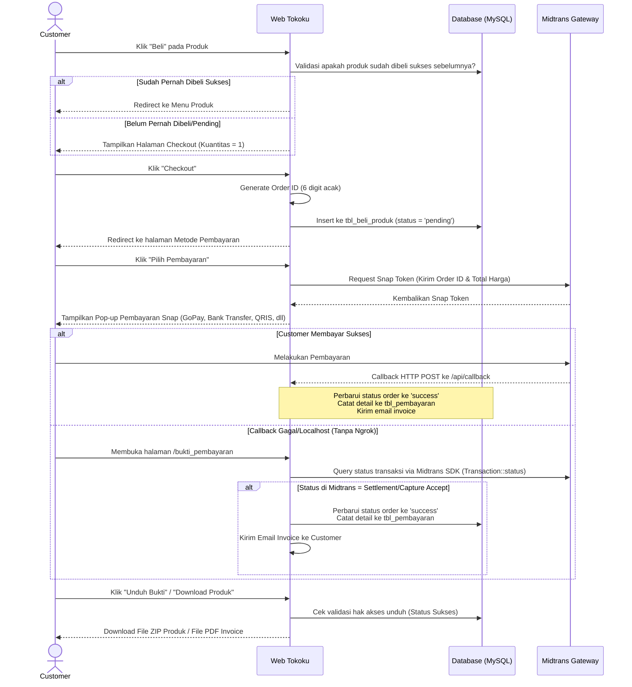
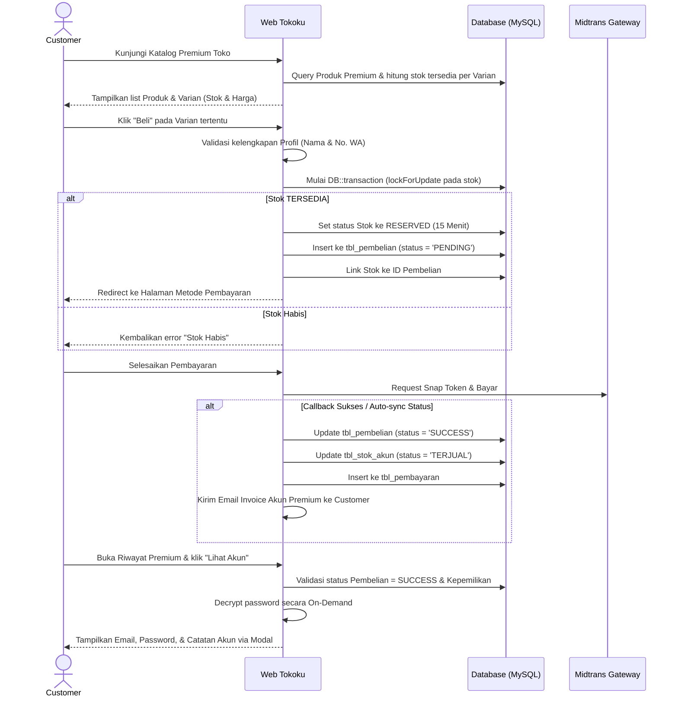

# Dokumentasi Fitur, Alur, dan Logika Pembelian Tokoku

Dokumen ini berisi analisis lengkap mengenai seluruh fitur, peran pengguna (roles), alur sistem, serta logika pembelian barang di platform **Tokoku** (aplikasi penjualan produk digital/source code menggunakan Laravel & Midtrans).

---

## 1. Peran Pengguna (Roles & Permissions)

Sistem ini memiliki dua peran utama yang dibedakan berdasarkan kolom `role_id` di database:

*   **Admin (Role ID: 1)**:
    *   Mengelola katalog produk (Tambah, Edit, Hapus data dan file ZIP produk).
    *   Mengunggah dan mengekstrak galeri tangkapan layar (*screenshots*) untuk detail produk.
    *   Melihat dashboard statistik penjualan harian.
    *   Melihat laporan analisis produk terjual.
*   **Customer (Role ID: 2)**:
    *   Menjelajahi menu produk digital.
    *   Melihat galeri detail produk (*screenshots*).
    *   Melakukan pemesanan dan pembayaran produk via Midtrans.
    *   Mengunduh file ZIP produk digital yang telah dibeli secara sukses.
    *   Melihat histori pembayaran dan mengunduh bukti pembayaran (Invoice PDF).
    *   Mengelola profil pribadi (Nama & Nomor Telepon) dan mengganti kata sandi.

---

## 2. Fitur-Fitur Utama Sistem

### A. Autentikasi & Keamanan (Authentication)
1.  **Registrasi Mandiri (Sign Up)**: Pendaftaran akun baru menggunakan email dan password (minimal 10 karakter).
    *   *Catatan Logic*: Jika mendaftar dengan email khusus `g4lihanggoro@gmail.com`, otomatis mendapatkan peran Admin (`role_id: 1`). Pendaftaran dengan email lain otomatis mendapatkan peran Customer (`role_id: 2`) beserta pembuatan record di tabel `tbl_customer`.
2.  **Login Akun**: Autentikasi email dan password menggunakan Laravel Auth Session dengan fitur *Remember Me*.
3.  **Google Single Sign-On (OAuth)**: Integrasi dengan Google OAuth via Laravel Socialite untuk login atau pendaftaran otomatis secara instan.
4.  **Reset Password**: Pengiriman link reset kata sandi ke email pengguna apabila lupa kata sandi.

### B. Manajemen Produk (Admin Only)
1.  **Katalog Produk CRUD**:
    *   **Create**: Unggah produk baru berupa file ZIP source code/aplikasi beserta nama, deskripsi, harga, dan status ketersediaan.
    *   **Read**: Menampilkan semua produk di database.
    *   **Update**: Memperbarui informasi produk dan memperbarui file ZIP produk (menghapus file lama).
    *   **Delete**: Menghapus data produk dari database sekaligus menghapus file ZIP produk secara permanen dari server.
2.  **Ekstraksi Tangkapan Layar (Screenshots Extraction)**:
    *   Admin mengunggah file ZIP berisi gambar screenshots produk.
    *   Sistem mengekstrak file ZIP tersebut secara otomatis ke direktori `public/assets/extract_[nama_zip]_[timestamp]`, kemudian mencatat nama folder tersebut ke tabel `tbl_screenshots_produk`.

### C. Profil & Pengaturan Akun (Customer & Admin)
1.  **Ganti Password**: Memperbarui password lama dengan password baru (minimal 10 karakter) disertai konfirmasi kecocokan password.
2.  **Update Profile (Customer)**: Mengubah nama lengkap dan nomor telepon. Validasi mencegah perubahan email ke email lain.

### D. Statistik & Pelaporan (Admin Only)
1.  **Dashboard Utama**:
    *   Menampilkan jumlah order sukses yang terjadi hari ini.
    *   Menampilkan total omzet/penjualan hari ini (dalam format Rupiah).
    *   Menampilkan total jumlah barang yang terjual hari ini.
    *   Menampilkan daftar nama customer yang melakukan pemesanan hari ini.
2.  **Laporan Produk Terjual**: Menampilkan daftar produk yang telah terjual setidaknya 1 kali beserta akumulasi jumlah kuantitas yang terjual.

---

## 3. Alur dan Logika Pembelian Produk (Purchase Flow)

Alur pembelian produk digital pada Tokoku dirancang dengan integrasi **Midtrans Snap API** dan database sinkronisasi otomatis.

### A. Diagram Alur Transaksi


### B. Penjelasan Detail Logika Program

1.  **Pencegahan Pembelian Ganda**:
    Sebelum halaman beli/checkout ditampilkan, program memeriksa tabel `tbl_beli_produk` untuk memverifikasi apakah Customer bersangkutan sudah memiliki transaksi berstatus `'success'` untuk produk tersebut. Jika sudah, customer diblokir dari pembelian ulang produk yang sama.
2.  **Pembuatan Order (Checkout)**:
    *   Kuantitas produk dibatasi maksimal `1` unit (karena merupakan produk digital).
    *   `order_id` dibuat secara acak sebanyak 6 digit menggunakan fungsi `rand(100000, 999999)`.
    *   Transaksi awal disimpan di tabel `tbl_beli_produk` dengan status `'pending'`.
3.  **Integrasi Snap Token**:
    Sistem mengirimkan data barang, harga, nama customer, nomor telepon, dan `order_id` unik ke Midtrans untuk mendapatkan `snapToken` yang digunakan oleh pustaka Javascript Snap (`snap.js`) di frontend untuk merender modal pilihan pembayaran.
4.  **Penanganan Tabrakan ID Transaksi (Snap Token Crash Prevention)**:
    Jika user menutup popup Snap sebelum membayar, lalu mengklik "Selesaikan Pembayaran" kembali:
    *   Midtrans melarang request `getSnapToken` dengan `order_id` yang sama.
    *   Sistem menangkap exception kegagalan pembuatan token Snap.
    *   Sistem melakukan cek status ke Midtrans. Jika statusnya `'pending'`, sistem langsung mengarahkan user kembali ke halaman invoice dengan pesan instruksi pembayaran ramah ("Pembayaran sedang ditangguhkan di Midtrans..."), menghindari crash aplikasi.
5.  **Sinkronisasi Status Otomatis (Auto-Sync)**:
    Jika notifikasi callback dari Midtrans terhambat (karena berjalan di localhost/tanpa Ngrok):
    *   Setiap kali halaman **Bukti Pembayaran** dimuat atau halaman **Metode Pembayaran** diakses, sistem secara proaktif menanyakan status `order_id` yang bersangkutan langsung ke server Midtrans melalui API `\Midtrans\Transaction::status($order_id)`.
    *   Apabila Midtrans merespon transaksi tersebut telah lunas (`settlement` / `capture` dengan `accept`), sistem secara otomatis memicu query lokal untuk memperbarui status transaksi menjadi `'success'`, membuat record pembayaran, dan mengirimkan email konfirmasi.
6.  **Database Trigger Penjualan**:
    Database memiliki trigger `after_update_tbl_beli_produk` pada tabel `tbl_beli_produk`. Ketika status berubah dari `'pending'` ke `'success'`, trigger ini secara otomatis menginput data kuantitas barang ke tabel `tbl_produk_terjual` untuk analisis penjualan.
7.  **Keamanan Unduhan (Download Security)**:
    Route `/download_produk/{id_produk}` dilindungi pengecekan kepemilikan. File ZIP produk hanya dapat diunduh jika `tbl_beli_produk` mencatat transaksi `'success'` atas nama pengguna tersebut untuk ID produk yang bersangkutan.

---

## 4. Alur dan Logika Pembelian Akun Premium (Premium Account Purchase Flow)

Fitur pembelian akun premium memungkinkan Customer membeli akses langganan (seperti Netflix, Spotify) di mana kredensial akun dikirimkan secara otomatis dari stok yang diunggah oleh Seller/Admin.

### A. Diagram Alur Transaksi Akun Premium


### B. Penjelasan Detail Logika & Controller Premium

#### 1. Penelusuran & Tampilan Katalog
- **Controller**: `PremiumCustomerController@katalog` ([PremiumCustomerController.php](file:///c:/Users/iki/Downloads/tokoku-main/tokoku-main/app/Http/Controllers/PremiumCustomerController.php))
- **Logika**:
  - Mengambil produk dengan filter `status = 'aktif'` dan `tipe_produk = 'premium'`. Mendukung filter pencarian nama produk serta filter `id_toko` untuk halaman toko seller.
  - Untuk setiap varian layanan pada produk (`varianLayanan`), sistem secara dinamis menghitung jumlah stok yang siap dijual dengan kueri:
    `StokAkun::where('id_varian', $varian->id_varian)->where('status', 'tersedia')->count()`
  - Mengarahkan customer ke tampilan grid-card premium (`resources/views/premium_customer/katalog.blade.php`).

#### 2. Proses Reservasi & Pembuatan Order (Checkout)
- **Controller**: `ProductController@proses_checkout_premium` ([ProductController.php](file:///c:/Users/iki/Downloads/tokoku-main/tokoku-main/app/Http/Controllers/ProductController.php))
- **Logika**:
  - Memeriksa apakah nama profil dan nomor telepon WhatsApp Customer sudah terisi. Jika belum, diarahkan untuk melengkapinya terlebih dahulu demi kemudahan pengiriman invoice.
  - Menjalankan **`DB::transaction`** dengan row lock untuk mengamankan data stok dan mencegah *race condition* (pembelian stok yang sama oleh 2 customer berbeda secara bersamaan):
    ```php
    $stok = StokAkun::where('id_varian', $id_varian)
        ->where('status', StokStatus::TERSEDIA)
        ->orderBy('created_at', 'asc') // First-In, First-Out (FIFO)
        ->lockForUpdate()
        ->first();
    ```
  - Jika stok tidak ditemukan, melempar exception `StokHabisException` dan membatalkan transaksi database.
  - Jika tersedia, mengubah status stok menjadi `'reserved'` dengan menetapkan kedaluwarsa reservasi selama 15 menit (`reserved_expired_at = now()->addMinutes(15)`).
  - Membuat record pembelian baru di tabel `tbl_pembelian` dengan status awal `'PENDING'` dan menyematkan `order_id` acak berbasis ULID agar aman dan unik.
  - Menghubungkan ID pembelian dengan stok yang di-reserve (`stok->id_pembelian = pembelian->id_pembelian`).

#### 3. Metode Pembayaran & Sinkronisasi Keberhasilan
- **Controller**: `PembayaranController@metode_pembayaran` & `PembayaranController@syncTransactionStatus` ([PembayaranController.php](file:///c:/Users/iki/Downloads/tokoku-main/tokoku-main/app/Http/Controllers/PembayaranController.php))
- **Logika**:
  - Customer membayar via Midtrans Snap.
  - Saat notifikasi Midtrans atau auto-sync dipicu (karena customer memuat halaman invoice/riwayat):
    - Jika pembayaran lunas, sistem memperbarui status di tabel `tbl_pembelian` menjadi `SUCCESS`.
    - Mengubah status stok di `tbl_stok_akun` menjadi `TERJUAL` dan mencatat `tanggal_terjual = now()`.
    - Mencatat detail transaksi keuangan ke tabel `tbl_pembayaran`.
    - Mengirimkan email konfirmasi invoice premium (`MailPremiumBeli`) ke alamat email customer.

#### 4. Pengambilan Kredensial Akun (Decrypt On-Demand)
- **Controller**: `PremiumCustomerController@kredensial` ([PremiumCustomerController.php](file:///c:/Users/iki/Downloads/tokoku-main/tokoku-main/app/Http/Controllers/PremiumCustomerController.php))
- **Logika**:
  - Mengamankan data sensitif: Kredensial (email & password) akun premium tidak pernah dirender langsung di HTML halaman riwayat untuk mencegah scraping.
  - Ketika customer mengklik tombol **"Lihat Akun"**, Javascript memicu request AJAX ke `/premium/kredensial/{id_pembelian}`.
  - Controller melakukan validasi ketat:
    - Memastikan peminta data adalah customer pemilik transaksi pembelian tersebut.
    - Memastikan status pembelian sudah bernilai `SUCCESS`.
  - Apabila valid, sistem mengambil kredensial. Kolom `password_encrypted` di dekripsi secara otomatis di layer aplikasi menggunakan fitur *Encrypted Cast* bawaan Laravel pada model `StokAkun` sebelum dikembalikan dalam format JSON untuk ditampilkan pada modal.

---

## 5. Manajemen Akun Premium oleh Seller (Seller Premium Management)

### A. Arsitektur Middleware & Hak Akses

Sistem menggunakan dua middleware terpisah yang bekerja berlapis:

| Middleware | Alias | Izin Akses | Digunakan untuk |
|---|---|---|---|
| `PreventCustomer` | `prevent.customer` | Admin (1) + Seller (3) | Premium Layanan (Tipe, Varian, Stok, Histori) |
| `AdminOnly` | `admin.only` | Admin (1) saja | Kelola Seller, Setting Komisi, Saldo Toko, Laporan Admin |

> **Root cause 403 sebelumnya**: `PreventCustomer` hanya mengizinkan `role_id == 1`. Setelah fix, middleware kini mengizinkan `role_id == 1 OR role_id == 3`.

### B. Jaminan Isolasi Data (Scoping per Toko)

Meskipun Seller dan Admin mengakses URL yang sama (`/premium/tipe`, `/premium/varian`, dst), data yang ditampilkan **sepenuhnya terisolasi per toko** berkat scoping di dalam `PremiumAdminController`:

```
tbl_produk (id_toko)
    └── tbl_tipe_layanan (id_produk → id_toko)
            └── tbl_varian_layanan (id_tipe)
                    └── tbl_stok_akun (id_varian)
```

Setiap query pada controller menelusuri rantai relasi ini ke atas dan memfilter berdasarkan `id_toko` toko milik Seller yang login:

```php
// Contoh scoping di stok_index (PremiumAdminController):
$toko = Toko::where('user_id', Auth::id())->firstOrFail();
$stok = StokAkun::whereHas('varianLayanan.tipeLayanan.produk', function ($q) use ($toko) {
    $q->where('id_toko', $toko->id_toko); // ← Scoped ke toko Seller ini saja
})->get();
```

**Seller A tidak bisa melihat/mengedit stok milik Seller B** karena setiap write-operation (`store`, `update`, `destroy`) juga memvalidasi kepemilikan sebelum eksekusi.

### C. Alur Kerja Seller Menambah Akun Premium

```mermaid
flowchart TD
    A[Seller Login] --> B[Sidebar: Tipe Layanan]
    B --> C{Sudah ada Produk Premium\ndi toko ini?}
    C -- Belum --> D[Buat Produk Premium dulu\ndi Menu Produk]
    D --> E[Tambah Tipe Layanan\ncontoh: Spotify Premium]
    C -- Sudah --> E
    E --> F[Tambah Varian Layanan\ncontoh: 1 Bulan, 3 Bulan]
    F --> G{Cara input Stok?}
    G -- Satu per satu --> H[Form Tambah Stok\nemail|password|catatan]
    G -- Banyak sekaligus --> I[Bulk Input Stok\nFormat: email|pass|catatan\nsatu baris per akun]
    H --> J[Stok tersimpan dengan\nstatus = tersedia]
    I --> J
    J --> K[Customer bisa melihat\nstok tersedia di Katalog Toko]
```

### D. Validasi Kepemilikan Saat Seller Menulis Data

Controller `PremiumAdminController` memvalidasi **setiap operasi tulis** dengan pola berikut (contoh untuk `stok_store`):

```php
// Cek apakah Varian yang dipilih Seller benar-benar milik tokonya
if (Auth::user()->role_id != 1) {
    $toko = Toko::where('user_id', Auth::id())->firstOrFail();
    $varian = VarianLayanan::where('id_varian', $request->id_varian)
        ->whereHas('tipeLayanan.produk', function($q) use ($toko) {
            $q->where('id_toko', $toko->id_toko); // ← Guard: hanya toko sendiri
        })->first();

    if (!$varian) abort(403, 'Unauthorized access.'); // Tolak jika bukan miliknya
}
```

Validasi ini memastikan bahwa:
- Seller **tidak bisa menginput stok** ke Varian milik toko lain, bahkan jika mereka mengetahui `id_varian`.
- Seller **tidak bisa melihat/menghapus stok** akun yang bukan milik tokonya.

