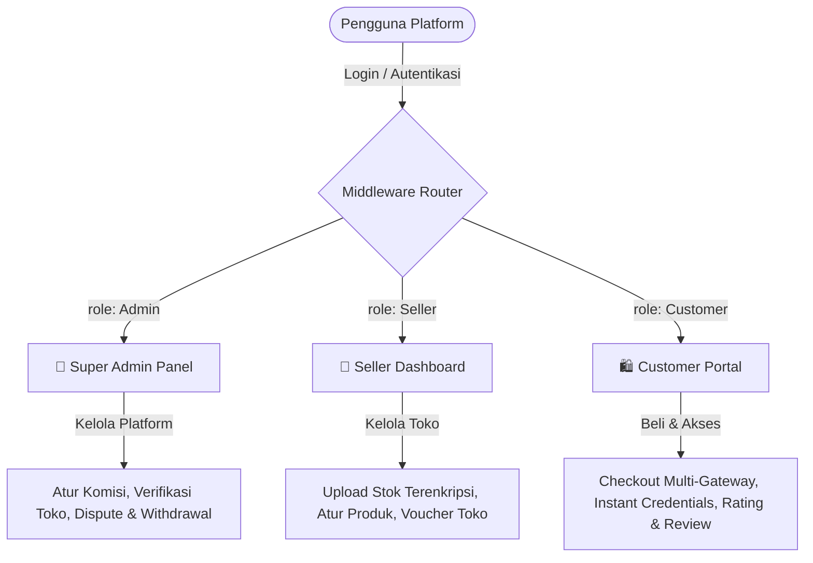
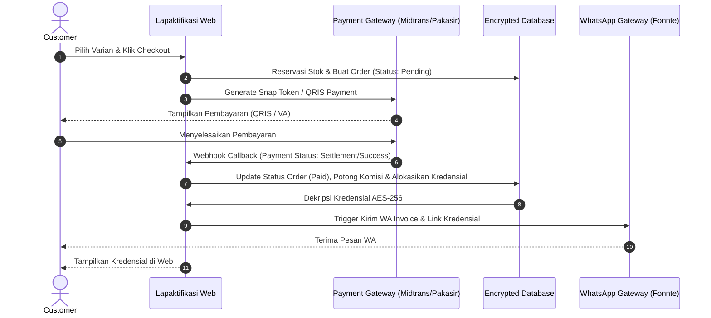

# 🚀 Lapaktifikasi — Dokumen Penjelasan & Panduan Lengkap Platform

---

## 📌 1. Pengenalan & Gambaran Umum (Overview)

**Lapaktifikasi** adalah platform *digital marketplace & e-commerce modern* generasi terbaru yang dirancang khusus untuk memfasilitasi transaksi jual-beli **produk digital** (seperti software, source code, e-book, desain, lisensi, dan file digital) serta **layanan akun premium** (seperti akun streaming Netflix/Spotify, tools produktivitas Canva/Adobe, VPN, dan layanan berlangganan digital lainnya).

Platform ini menghubungkan tiga entitas utama—**Customer (Pembeli)**, **Seller (Penjual/Toko)**, dan **Super Admin (Pengelola)**—dalam satu ekosistem terpadu yang aman, otomatis, dan berkinerja tinggi.

### 🎯 Visi & Tujuan Utama
- **Otomatisasi Penuh (Automated Instant Delivery)**: Menghilangkan jeda pengiriman manual. Setelah pembayaran terverifikasi oleh *Payment Gateway*, sistem langsung memberikan kredensial akun terenkripsi (username & password) atau link unduhan file digital secara *real-time*.
- **Keamanan Data Maksimal**: Melindungi data inventaris kredensial penjual menggunakan enkripsi kuat AES-256 (`Crypt::encryptString`) sehingga data sensitif tidak dapat diintip oleh pihak tak berwenang.
- **Dukungan Multi-Toko (Multi-Merchant Ecosystem)**: Memungkinkan banyak penjual (seller) membuka toko digital mereka sendiri, mengelola inventaris, menetapkan harga, dan memantau pendapatan toko secara independen.
- **Mobile API Ready**: Menyediakan RESTful API v1 lengkap berbasis *Laravel Sanctum* untuk memudahkan integrasi dengan aplikasi mobile (Android / iOS / Flutter / React Native).

---

## 🛠️ 2. Teknologi & Spesifikasi Stack (Tech Stack)

Platform Lapaktifikasi dibangun menggunakan kombinasi teknologi modern, stabil, dan scalable:

| Komponen | Teknologi / Library | Deskripsi / Kegunaan |
| :--- | :--- | :--- |
| **Core Framework** | Laravel 10.x | Framework PHP robust untuk menangani backend, routing, & ORM Eloquent |
| **Bahasa Pemrograman**| PHP >= 8.1 | Fitur bahasa modern, performa tinggi, & type safety |
| **Database System** | MySQL / MariaDB | Penyimpanan data relasional dengan pengindeksan optimal |
| **Frontend Rendering** | Blade Templating Engine | Tampilan web dinamis, cepat, dan terstruktur |
| **Styling & Assets** | Vanilla CSS + Vite | Desain modern, responsive, UI premium, & bundling asset kilat |
| **Payment Gateways** | Midtrans & Pakasir | Otomatisasi pembayaran (QRIS instan, E-Wallet, VA Bank) |
| **WhatsApp Gateway** | Fonnte API | Pengiriman notifikasi otomatis invoice & kredensial via WhatsApp |
| **API Authentication** | Laravel Sanctum | Token-based Auth aman untuk rute API mobile |
| **Social Login** | Laravel Socialite | Autentikasi 1-klik menggunakan Akun Google |
| **Dokumen & Invoice** | Barryvdh Laravel DomPDF | Generator invoice pembayaran otomatis format PDF |
| **Barcode / QR Code** | SimpleQRCode | Pembuat QR code instan untuk transaksi & referensi |

---

## 👥 3. Arsitektur Multi-Role Access Control

Sistem mengadopsi kontrol akses berbasis peran (RBAC) ketat dengan pemisahan 3 role utama yang dilindungi oleh middleware khusus:



### 🔐 Proteksi Middleware Utama
1. **`admin.only`**: Memastikan hanya akun dengan hak akses Super Admin yang dapat membuka dashboard pengelola global, konfigurasi komisi, dan fitur audit.
2. **`only.seller`**: Mengisolasi area dashboard penjual agar seller hanya dapat mengelola data toko milik mereka sendiri (*Multi-tenant Store Isolation*).
3. **`only.customer`**: Memastikan alur checkout, pengunduhan invoice, dan klaim kredensial hanya diakses oleh pembeli yang sah.
4. **`prevent.customer`**: Mencegah akun ber-role customer mengakses rute manajemen internal.

---

## 💎 4. Rincian Fitur Berdasarkan Peran (Roles & Features)

### 👑 4.1 Fitur Super Admin (Pengelola Platform)
- **Super Dashboard Analytics**: Monitoring transaksi global real-time, statistik total GMV (Gross Merchandise Value), pendapatan komisi platform, dan grafik pertumbuhan bisnis.
- **Manajemen Seller & Verifikasi Toko**:
  - Pendaftaran seller baru & pemantauan performa seluruh toko.
  - Sakelar status toko (*Activate / Deactivate*).
  - Manajemen Badge Resmi (*Verified Seller*, *Top Merchant*, *Trusted Seller*).
  - Generator *Custom Badge* per toko (nama, icon, deskripsi).
- **Pengaturan Komisi Platform & Batas File**:
  - Konfigurasi persentase pemotongan komisi platform secara terpusat untuk setiap transaksi penjualan.
  - Pengaturan batas maksimal ukuran file upload produk digital (dalam Megabyte).
- **Kelola Saldo & Pencairan Dana (Withdrawal)**:
  - Monitoring akumulasi saldo toko.
  - Audit mutasi saldo debit/kredit seller.
  - Pemrosesan pencairan dana (*payout*) ke rekening penjual.
- **Voucher Promo Nasional (Global Voucher)**:
  - Pembuatan voucher promo berlaku di seluruh toko.
  - Opsi persentase (%) atau nominal rupiah (Rp), minimal belanja, maksimal diskon, kuota penggunaan, & periode aktif.
- **Pusat Pengaduan & Dispute Resolution**:
  - Penanganan laporan komplain dari customer terkait kendala kredensial.
  - Update status laporan (*Pending*, *In Progress*, *Resolved*, *Rejected*) beserta catatan resolusi admin.
- **WhatsApp Notification Engine**:
  - Monitoring log pengiriman WA via Fonnte Gateway.
  - Fitur pengiriman ulang pesan WA secara manual (*Retry WA Notification*) jika terjadi kendala jaringan.

---

### 🏪 4.2 Fitur Seller (Penjual / Toko)
- **Seller Dashboard & Inventory Alert**:
  - Statistik pendapatan toko, total pesanan sukses, dan peringatan *real-time* jika stok produk mendekati habis atau kosong.
- **Mutasi Saldo Transparan**:
  - Catatan riwayat masuk/keluarnya saldo toko, rincian potongan komisi platform, serta riwayat pencairan dana.
- **Pengaturan Profil & Identitas Toko**:
  - Kustomisasi nama toko, deskripsi, logo, banner, alamat, dan nomor kontak.
  - Penampilan *reputation badges* dari admin pada halaman toko.
- **Manajemen Produk Premium & Digital**:
  - **Produk Premium**: Pengelolaan varian durasi (1 Bulan, 3 Bulan, 1 Tahun) dan tipe varian (Private Account, Sharing Account, Profile Slot).
  - **Produk Digital**: Upload file (ZIP/RAR/PDF/EXE) dengan validasi ukuran file otomatis.
- **Keamanan Inventaris Stok Terenkripsi**:
  - Input kredensial (Username, Password, Catatan Akses) per varian.
  - Fitur *Bulk Upload / Mass Upload* stok kredensial.
  - Enkripsi otomatis AES-256 pada database & fitur dekripsi aman untuk pengujian seller.
- **Manajemen Voucher Toko (Store Discount)**:
  - Pembuatan kode diskon mandiri khusus untuk produk-produk di toko seller sendiri.

---

### 🛍️ 4.3 Fitur Customer (Pembeli)
- **Eksplorasi Katalog & Toko**:
  - Pencarian dan filter produk berdasarkan kategori, harga, tipe, dan nama toko.
  - Halaman detail produk lengkap dengan stok real-time, reputasi toko, dan ulasan pembeli lain.
- **Checkout Multi-Gateway & Payment Automation**:
  - Dukungan **Midtrans** (QRIS, GoPay, ShopeePay, Mandiri, BCA, BNI, BRI, Permata, Credit Card) dan **Pakasir** (QRIS & E-Wallet).
  - Reservasi stok sementara saat checkout untuk mencegah bentrok stok (*double booking*).
  - Countdown timer masa berlaku pembayaran transaksi.
- **Pengiriman Kredensial & File Otomatis**:
  - Akses kredensial (username/password terdekripsi) langsung di halaman riwayat transaksi begitu pembayaran *Paid*.
  - Tombol unduh file produk digital aktif seketika setelah pembayaran berhasil.
  - Notifikasi otomatis WhatsApp berisi invoice & link kredensial.
- **Member Tier & Referral System**:
  - Tingkatan level member (Bronze, Silver, Gold, Platinum) berdasarkan total akumulasi transaksi.
  - Link/Kode Referral unik untuk mengajak pengguna baru dan melacak riwayat pendaftaran.
- **Invoice PDF, Ulasan & Komplain**:
  - Unduh invoice transaksi resmi format PDF.
  - Pemberian rating bintang (1-5) dan ulasan pada produk yang dibeli.
  - Pengajuan laporan komplain jika akun/file mengalami kendala.

---

## ⚡ 5. Alur Kerja Utama Sistem (Core Business Flow)

### 🔄 5.1 Alur Transaksi Pembelian & Pengiriman Otomatis



---

## 🔒 6. Arsitektur Keamanan & Proteksi Data (Security Architecture)

1. **Enkripsi Kredensial Sensitif (AES-256)**:
   - Data password dan kredensial akun premium yang di-input seller dienkripsi menggunakan standar industri `Crypt::encryptString()` sebelum disimpan di basis data.
2. **Keamanan Webhook & Audit Logging**:
   - Setiap respon *callback* dari Midtrans & Pakasir diautentikasi dengan verifikasi signature key dan dicatat dalam tabel audit log (`midtrans_webhook_logs`, `pakasir_webhook_logs`).
3. **Proteksi Brute Force & Rate Limiting**:
   - Pembatasan jumlah percobaan login dan akses API per menit via Laravel Throttle Middleware.
4. **Proteksi Injeksi & XSS**:
   - Seluruh input disanitasi dan menggunakan query binding Laravel Eloquent ORM.

---

## 📱 7. Integration RESTful API v1 (Mobile Ready)

Platform menyediakan API RESTful V1 yang dapat langsung digunakan oleh pengembang aplikasi mobile:

- **Base URL**: `https://domain-anda.com/api/v1`
- **Autentikasi Header**: `Authorization: Bearer <SANCTUM_TOKEN>`

### Ringkasan Group Endpoint API:
- `POST /auth/register` — Pendaftaran pengguna baru (dukungan kode referral)
- `POST /auth/login` — Login pengguna & penerbitan Bearer Token
- `GET /catalog/products` — Mendapatkan daftar katalog produk & filter
- `GET /catalog/stores/{id}` — Detail profil toko, badge, & katalog produk toko
- `POST /customer/checkout` — Proses checkout & pembuat transaksi baru
- `GET /customer/orders/{id}/credential` — Mengambil kredensial terdekripsi pesanan lunas
- `POST /customer/reviews` — Mengirimkan ulasan & rating produk
- `GET /seller/dashboard` — Ringkasan statistik & pendapatan penjual
- `POST /seller/products` — Tambah/Update produk & varian seller
- `GET /admin/dashboard` — Statistik global platform untuk Super Admin

*(Dokumentasi lengkap skema JSON dan contoh payload dapat dilihat pada file [api.md](file:///c:/Users/iki/Documents/CODING%20KERJA/LAPAKTIFIKASI/lapaktifikasi_web/api.md)).*

---

## ⚙️ 8. Panduan Instalasi & Pengoperasian (Installation & Setup)

### 📋 Prasyarat Sistem (Prerequisites)
- PHP >= 8.1 dengan ekstensi (`OpenSSL`, `PDO`, `Mbstring`, `Tokenizer`, `XML`, `Ctype`, `JSON`, `BCMath`, `GD`)
- Composer >= 2.x
- MySQL >= 8.0 / MariaDB >= 10.4
- Node.js >= 18.x & NPM

### 🛠️ Langkah Instalasi Lokal (Local Setup)

1. **Clone Repository / Navigasi ke Folder Project**:
   ```bash
   cd "c:\Users\iki\Documents\CODING KERJA\LAPAKTIFIKASI\lapaktifikasi_web"
   ```

2. **Install Dependensi Backend (PHP)**:
   ```bash
   composer install
   ```

3. **Install Dependensi Frontend (Node)**:
   ```bash
   npm install
   ```

4. **Konfigurasi Environment File (`.env`)**:
   Duplikat file `.env.example` menjadi `.env` dan sesuaikan variabel kunci:
   ```env
   APP_NAME=Lapaktifikasi
   APP_ENV=local
   APP_URL=http://localhost:8000

   DB_CONNECTION=mysql
   DB_HOST=127.0.0.1
   DB_PORT=3306
   DB_DATABASE=lapaktifikasi_db
   DB_USERNAME=root
   DB_PASSWORD=

   # Midtrans Payment Gateway
   MIDTRANS_SERVER_KEY=SB-Mid-server-xxxxxxxxx
   MIDTRANS_CLIENT_KEY=SB-Mid-client-xxxxxxxxx
   MIDTRANS_IS_PRODUCTION=false

   # Fonnte WhatsApp Gateway
   FONNTE_TOKEN=your_fonnte_api_token
   ```

5. **Generate Application Key**:
   ```bash
   php artisan key:generate
   ```

6. **Migrasi Database & Database Seeding**:
   ```bash
   php artisan migrate --seed
   ```

7. **Memunculkan Storage Link**:
   ```bash
   php artisan storage:link
   ```

8. **Menjalankan Server Lokal**:
   ```bash
   php artisan serve
   ```
   Aplikasi dapat diakses melalui browser di `http://127.0.0.1:8000`.

---

## 📄 9. Struktur Berkaitan Lainnya

- [deskripsi.md](file:///c:/Users/iki/Documents/CODING%20KERJA/LAPAKTIFIKASI/lapaktifikasi_web/deskripsi.md) — Ringkasan singkat fitur & manfaat bisnis Lapaktifikasi.
- [fitur.md](file:///c:/Users/iki/Documents/CODING%20KERJA/LAPAKTIFIKASI/lapaktifikasi_web/fitur.md) — Daftar inventaris seluruh fitur platform (Admin, Seller, Customer).
- [api.md](file:///c:/Users/iki/Documents/CODING%20KERJA/LAPAKTIFIKASI/lapaktifikasi_web/api.md) — Spesifikasi teknis endpoint RESTful API v1 & payload request/response JSON.

---
*© 2026 Lapaktifikasi Ecosystem. All Rights Reserved.*
