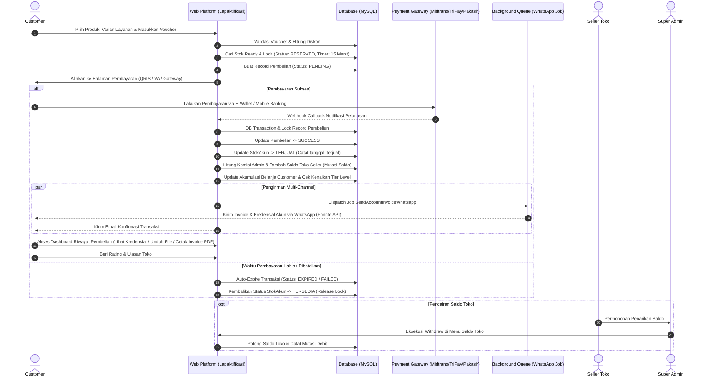

# 📘 Dokumentasi Lengkap & Spesifikasi Fitur Sistem Web Lapaktifikasi

**Lapaktifikasi** adalah platform *digital marketplace & e-commerce* modern yang dirancang khusus untuk memfasilitasi transaksi jual-beli **Akun Layanan Premium** (seperti Spotify, Netflix, YouTube Premium, Canva Pro, ChatGPT, dll) dan **Produk Berkas Digital** (seperti Source Code ZIP, Dokumen/E-Book, Modul Pembelajaran, Preset, dan Template Desain).

Platform ini mengintegrasikan ekosistem multi-peran (*multi-role architecture*) yang menghubungkan **Customer (Pembeli)**, **Seller (Mitra Toko)**, dan **Super Admin (Pengelola Platform)** dalam satu sistem yang aman, transparan, dan terotomatisasi secara *real-time*.

---

## 🏗️ 1. Arsitektur Sistem & Spesifikasi Teknologi

Sistem Lapaktifikasi dibangun di atas tumpukan teknologi (*technology stack*) modern dengan standar performa dan keamanan tinggi:

- **Framework Backend:** Laravel (PHP) dengan arsitektur *Model-View-Controller* (MVC), Service Layer Pattern, dan Policy Authorization.
- **Database Management System:** MySQL Relasional dengan integritas data berbasis *Foreign Key Constraints*, transaksi database atomik (`DB::transaction`), dan *Pessimistic Locking* (`lockForUpdate`).
- **Autentikasi & Otorisasi:**
  - Web Session Multi-Auth dengan Middleware Role-Based Access Control (RBAC).
  - API Token Authentication menggunakan **Laravel Sanctum**.
  - Login pihak ketiga (*Single Sign-On*) via **Google OAuth 2.0**.
  - Fitur wajib ganti password awal (*Must Change Password*) dan sistem pemblokiran akun (*Banned System*).
- **Payment Gateway Terintegrasi (Multi-Gateway Engine):**
  - **Midtrans Snap Engine:** Pembayaran instan via QRIS (Gopay, ShopeePay, OVO, DANA), Virtual Account Bank (BCA, Mandiri, BNI, BRI, Permata), dan Kartu Kredit.
  - **TriPay Gateway:** Pembayaran multi-channel real-time dengan verifikasi signature HMAC-SHA256.
  - **Pakasir Gateway:** Gateway pembayaran QRIS & merchant alternatif.
  - *Dynamic Gateway Switcher:* Admin dapat mengaktifkan/menonaktifkan gateway tertentu kapan saja melalui panel admin.
- **Background Queue & Notifikasi Otomatis:**
  - **WhatsApp API Gateway (Fonnte):** Queue Job pengiriman invoice otomatis, kredensial akun, dan tautan download langsung ke nomor WhatsApp customer seketika setelah pembayaran terkonfirmasi.
  - **Email Notification (SMTP/Mailgun):** Pengiriman email konfirmasi order dan detail transaksi format HTML responsive.
- **Generator Dokumen:**
  - **DomPDF:** Auto-generate lembar invoice resmi format PDF berstandar komersial lengkap dengan rincian transaksi, kode order unik, dan status lunas.
- **Proteksi & Keamanan Data:**
  - Enkripsi dua arah kredensial akun (*Username/Email & Password*) pada database menggunakan *AES-256-CBC* (`Illuminate\Support\Facades\Crypt`). Password hanya didekripsi secara *on-demand* saat customer yang berhak mengaksesnya.
  - *Stock Lock Reservation Timer:* Penguncian stok selama 15 menit menggunakan countdown timer guna mencegah *double-booking* atau perebutan stok saat proses pembayaran berlangsung.
  - *Maintenance Mode Guard:* Saklar pemeliharaan platform menyeluruh yang dapat diaktifkan Super Admin dengan tampilan ramah pengguna.

---

## 👥 2. Matriks Peran & Hak Akses Pengguna (Role Breakdown)

Sistem membagi akses pengguna ke dalam 3 hierarki peran:

```
┌─────────────────────────────────────────────────────────────────────────┐
│                       LAPAKTIFIKASI ECOSYSTEM                           │
└────────────┬────────────────────────────┼───────────────────────────────┘
             │                            │                               
             ▼                            ▼                               ▼
  ┌───────────────────────┐   ┌───────────────────────┐       ┌───────────────────────┐
  │     SUPER ADMIN       │   │        SELLER         │       │       CUSTOMER        │
  │      (Role ID: 1)     │   │      (Role ID: 3)     │       │      (Role ID: 2)     │
  └───────────────────────┘   └───────────────────────┘       └───────────────────────┘
```

---

## 🟢 3. Fitur Lengkap Customer (Pelanggan / Pembeli) — Role 2

Customer adalah pengguna yang mendaftar untuk membeli akun premium atau mengunduh aset produk digital.

### 3.1. Eksplorasi Katalog & Toko Seller
1. **Katalog Produk Global (`/premium/katalog`):**
   - Menjelajahi seluruh produk yang berstatus aktif dari seluruh seller terverifikasi.
   - Filter instan berdasarkan Kategori Produk (`Semua`, `Akun Premium`, `File Digital`).
   - Fitur pencarian cepat berdasarkan kata kunci nama produk atau deskripsi produk.
   - Indikator harga terendah hingga tertinggi (*Price Range*), badge toko penjual, rating bintang rata-rata, dan total ulasan.
2. **Direktori Daftar Toko (`/daftar_toko`):**
   - Menampilkan seluruh etalase toko seller yang aktif dengan paginasi rapi.
   - Menampilkan logo toko, nama toko, badge reputasi toko (*Verified*, *Top Seller*, dll), dan deskripsi singkat toko.
3. **Katalog Toko Tertentu (`/toko/{slug}/produk`):**
   - Menampilkan katalog produk khusus yang hanya dijual oleh toko yang dipilih beserta profil lengkap toko tersebut.
4. **Halaman Detail Produk Interaktif (`/toko/{store_slug}/produk/{product_slug}`):**
   - **URL SEO-Friendly:** Format tautan ramah mesin pencari.
   - **Galeri Visual:** Menampilkan cover gambar utama produk beserta screenshot pendukung.
   - **Pemilih Tipe & Varian Layanan:** Memilih jenis paket (misal: *Private*, *Sharing*, *Family*) dan durasi hari (misal: *30 Hari*, *90 Hari*, *365 Hari*).
   - **Live Stock Checker:** Pengecekan sisa stok akun secara *real-time* via Ajax tanpa perlu merefresh halaman.
   - **Breakdown Ulasan & Rating Bintang:** Menampilkan distribusi rating (Bintang 1 sampai 5) dan riwayat testimoni ulasan dari pembeli terverifikasi sebelumnya.

### 3.2. Transaksi, Checkout, & Multi-Payment Gateway
1. **Validasi Profil Sebelum Checkout:**
   - Sistem mewajibkan Customer melengkapi Nama dan Nomor WhatsApp di profil terlebih dahulu sebelum dapat membuat pesanan, guna memastikan pengiriman kredensial akun berjalan sukses.
2. **Klaim & Penggunaan Voucher Diskon:**
   - Input kode kupon diskon langsung di halaman pesanan.
   - Sistem secara otomatis memvalidasi jenis voucher (Global atau Toko Spesifik), syarat minimal belanja, masa berlaku, dan kuota pemakaian.
   - Potongan harga langsung dihitung secara transparan (tipe persen maupun potongan nominal).
3. **Reservasi & Penguncian Stok (Stock Lock 15 Menit):**
   - Seketika tombol checkout ditekan, 1 stok akun akan diubah statusnya menjadi `RESERVED` dan dikunci untuk pesanan tersebut selama 15 menit.
   - Mencegah pembeli lain merebut stok yang sama saat customer sedang menyelesaikan pembayaran.
4. **Pemilihan Gateway & Saluran Pembayaran (`/metode_pembayaran/{order_id}`):**
   - **QRIS Instan:** Tampilan QR Code QRIS yang dapat di-scan oleh seluruh aplikasi e-wallet (GoPay, OVO, DANA, ShopeePay, LinkAja) dan Mobile Banking.
   - **Virtual Account (VA):** Nomor VA Bank BCA, Mandiri, BNI, BRI, Permata yang dapat disalin dengan mudah.
   - **Auto-Sync Polling:** Halaman status pembayaran secara cerdas memeriksa status pelunasan di background (`/api/status/{order_id}`) dan otomatis berpindah halaman begitu pembayaran lunas.

### 3.3. Akses Produk & Riwayat Pembelian (`/premium/riwayat`)
1. **Akses Kredensial Akun Instan (On-Demand Decryption):**
   - Begitu pembayaran terverifikasi LUNAS (`SUCCESS`), username/email dan password akun digital langsung muncul di dashboard customer.
   - Terdapat tombol *Copy Kredensial* dan instruksi/catatan khusus dari seller.
2. **Download File Digital Aman:**
   - Untuk produk kategori *File Digital*, customer mendapatkan tombol unduh file (.zip, .pdf, dll) yang diamankan dengan validasi hak kepemilikan transaksi.
3. **Unduh Lembar Invoice PDF Resmi:**
   - Cetak dan simpan invoice transaksi format PDF sewaktu-waktu sebagai bukti pembelian yang sah.
4. **Filter Rentang Tanggal Riwayat:**
   - Kemudahan memfilter data riwayat transaksi berdasarkan tanggal mulai hingga tanggal akhir (maksimal rentang 1 tahun).
5. **Beri Ulasan & Testimoni:**
   - Memberikan rating bintang (1 - 5) dan ulasan pengalaman berbelanja untuk toko seller terkait pesanan yang telah selesai.

### 3.4. Sistem Tingkatan Member (Customer Tiering System) (`/premium/member`)
1. **Level Gamifikasi Pelanggan:**
   - Tier member berjenjang (seperti *Bronze*, *Silver*, *Gold*, *Platinum*) berdasarkan total akumulasi belanja customer di Lapaktifikasi.
2. **Progress Bar Menuju Tier Berikutnya:**
   - Menampilkan persentase progress capaian, tier saat ini, serta sisa nominal belanja yang dibutuhkan untuk naik kelas level.
3. **Katalog Voucher Eksklusif Member:**
   - Menampilkan voucher promo yang tersedia di sistem yang dapat langsung diklaim ke akun customer dengan 1 klik.

### 3.5. Program Referral / Ajak Teman (`/premium/referral`)
1. **Kode & Link Referral Unik:**
   - Setiap customer memiliki kode referral unik otomatis (format: `REF-XXXXXX`) dan tautan pendaftaran khusus.
2. **Tracking Referral:**
   - Memantau jumlah teman yang berhasil diajak mendaftar dan berbelanja di platform.
3. **Bonus Akumulasi Referral:**
   - Customer yang mereferensikan pengguna baru mendapatkan reward/komisi akumulasi yang masuk ke catatan pencapaian akun.

### 3.6. Layanan Bantuan & Klaim Garansi (`/premium/laporan`)
1. **Pengajuan Tiket Komplain:**
   - Jika akun digital mengalami kendala login atau masa garansi bermasalah, customer dapat membuat tiket laporan baru dengan menyertakan judul kendala, deskripsi lengkap, serta lampiran screenshot bukti error.
2. **Monitoring Status Tiket:**
   - Memantau penanganan komplain secara transparan dengan 3 status: `Pending` (Menunggu Antrean), `Proses` (Sedang Ditangani), dan `Selesai` (Solusi Diberikan).

---

## 🟡 4. Fitur Lengkap Seller (Mitra Penjual / Toko) — Role 3

Seller adalah pihak mitra yang membuka toko di platform Lapaktifikasi untuk menjual akun premium dan produk file digital secara otomatis.

### 4.1. Dashboard & Analitik Performa Toko (`/seller/dashboard`)
1. **Metrik Finansial & Penjualan:**
   - Total Pesanan Berhasil (*Total Orders*).
   - Total Omzet Kotor Penjualan (*Gross Revenue*).
   - Total Saldo Toko Berjalan (*Available Balance*) yang siap dicairkan.
   - Total Akun & File Terjual (*Total Items Sold*).
2. **Filter Rentang Waktu:**
   - Filter analitik berdasarkan *Hari Ini*, *7 Hari Terakhir*, *Bulan Ini*, atau *Rentang Tanggal Custom*.
3. **Riwayat Mutasi Saldo Toko (`/seller/mutasi`):**
   - Menampilkan buku besar pencatatan kas toko:
     - **Kredit (+):** Saldo masuk otomatis dari hasil penjualan produk setelah dipotong komisi platform secara transparan.
     - **Debit (-):** Saldo keluar saat Admin mencairkan (*withdraw*) dana seller ke rekening bank.

### 4.2. Pengaturan & Branding Toko (`/seller/profil`)
1. **Profil Identitas Toko:**
   - Mengubah Nama Toko, Nomor Telepon/WhatsApp resmi CS toko, dan Akun Telegram Toko.
   - Mengatur deskripsi informasi toko (jam operasional, syarat garansi khusus, dll).
2. **Upload Logo Brand Toko:**
   - Kustomisasi foto/logo toko yang tampil di katalog publik, invoice, dan detail produk.

### 4.3. Manajemen Produk Akun Premium (`/menu_produk`)
1. **CRUD Master Produk Premium:**
   - Menambahkan master judul produk (misal: *Netflix Premium UHD*, *Spotify Individual*).
   - Upload cover thumbnail produk dengan kompresi visual yang optimal.
   - Mengatur status tayang produk (`aktif` / `nonaktif`).
2. **Sistem Proteksi Riwayat Transaksi:**
   - Jika suatu produk sudah pernah dibeli oleh customer, penghapusan produk secara cerdas dicegah oleh sistem. Sebagai gantinya, status produk otomatis dinonaktifkan agar integritas riwayat pembeli lama tetap terjaga.

### 4.4. Manajemen Inventaris Premium (`/premium/inventaris`)
Panel khusus tiga tab (*Three-Tab Interface*) untuk tata kelola stok akun:
1. **Tab 1 — Tipe Layanan (`tbl_tipe_layanan`):**
   - Mengelompokkan jenis paket di bawah master produk (misal: *Private 1 Profile*, *Private 5 Profile*, *Sharing 1 Device*).
2. **Tab 2 — Varian Layanan (`tbl_varian_layanan`):**
   - Mengatur durasi aktif akun dalam satuan hari (misal: *30 Hari*, *90 Hari*, *365 Hari*).
   - Menetapkan harga jual per varian.
   - Menambahkan catatan spesifikasi paket.
3. **Tab 3 — Inventaris Stok Akun Digital (`tbl_stok_akun`):**
   - **Input Stok Satuan (*Single Input*):** Input Email/Username, Password, dan Catatan Tambahan.
   - **Input Stok Massal (*Bulk Import*):** Fitur input puluhan akun sekaligus dalam 1 kali klik menggunakan format pemisah pipa:
     ```text
     email1@gmail.com|password123|Profil 1 PIN 1234
     email2@gmail.com|password456|Profil 2 PIN 5678
     ```
   - **Enkripsi Kredensial Otomatis:** Seluruh password dienkripsi seketika saat disimpan ke database.
   - **Dekripsi Password On-Demand:** Seller pemilik toko dapat meninjau kredensial akun miliknya melalui modal *Show Password* yang aman.
   - **Status Stok Otomatis:**
     - `TERSEDIA` : Stok siap dijual dan dapat dipesan pembeli.
     - `RESERVED` : Stok sedang dikunci sementara oleh checkout customer.
     - `TERJUAL` : Stok telah berhasil dibeli dan kredensialnya sudah diserahkan ke pembeli.

### 4.5. Manajemen Produk & Inventaris File Digital (`/menu_produk_digital` & `/digital/inventaris`)
1. **Katalog Produk Digital:**
   - Mengelola master produk aset digital (E-Book, Script Source Code, Template Grafis, Dokumen).
2. **Upload Berkas Master Digital:**
   - Mengunggah file master digital ke server storage dengan validasi batas ukuran file (*file size limit*) sesuai konfigurasi platform.
   - File digital diatur durasinya 0 hari (akses permanen seumur hidup bagi pembeli).

### 4.6. Histori Penjualan Seller (`/premium/histori`)
- Memantau daftar seluruh transaksi pesanan yang masuk khusus ke toko seller.
- Filter berdasarkan rentang tanggal penjualan.
- Melihat informasi customer pemesan, tanggal bayar, varian yang dibeli, serta status penyelesaian order.

### 4.7. Manajemen Voucher Toko (`/seller/voucher`)
- Membuat kupon diskon promo yang hanya berlaku eksklusif untuk produk di tokonya sendiri (`scope: toko_spesifik`).
- Mengatur tipe diskon (Persentase % dengan batas maksimal rupiah, atau Potongan Nominal Rp langsung).
- Mengatur syarat minimal transaksi belanja, kuota total pemakaian kupon, serta rentang tanggal berlaku kupon.
- Fitur *Toggle Status* aktif/nonaktif kupon seketika.

### 4.8. Sistem Reputasi & Badge Toko (`/seller/badges`)
- Memantau pencapaian lencana reputasi toko:
  - **Lencana Rating Minimal:** Misal meraih rating rata-rata di atas 4.8 bintang.
  - **Lencana Lama Bergabung:** Misal telah bermitra selama lebih dari 30 / 90 / 180 hari.
  - **Lencana Volume Transaksi:** Misal telah menyelesaikan lebih dari 50 / 100 / 500 pesanan sukses.
  - **Lencana Custom:** Penghargaan khusus yang diberikan langsung oleh Super Admin.
- Tampilan kartu badge interaktif lengkap dengan *progress bar* persentase pemenuhan syarat dan sisa target yang harus dicapai.

---

## 🔴 5. Fitur Lengkap Super Admin (Pengelola Platform) — Role 1

Super Admin memegang kendali tertinggi (*Full Privilege*) terhadap seluruh tata kelola ekosistem, moderasi, keuangan, dan pengaturan teknis website.

### 5.1. Dashboard Utama Platform (`/dashboard`)
- **Statistik Global Hari Ini:**
  - Total Order Masuk Platform (keseluruhan produk dan toko).
  - Total Omzet Perputaran Finansial Platform Hari Ini.
  - Total Akun & File Digital Terjual Hari Ini.
  - Tabel Live Feed transaksi terbaru beserta nama customer, Order ID, dan status pelunasan.

### 5.2. Master Kontrol Produk & Inventaris Global
- Super Admin memiliki visibilitas penuh untuk melihat, mencari, memvalidasi, menyunting, atau menonaktifkan seluruh produk, tipe layanan, varian, dan stok akun dari semua seller tanpa batasan scoping.

### 5.3. Manajemen & Moderasi Seller (`/kelola_seller`)
1. **Pendaftaran Seller Baru:**
   - Admin dapat membuat akun Seller dan Toko baru secara langsung dengan menentukan username, email, password awal, nomor telepon, dan akun Telegram.
   - Akun baru otomatis diberi status `must_change_password` agar seller wajib memperbarui password saat pertama kali login.
2. **Kustomisasi Komisi Override per Toko:**
   - Admin dapat menetapkan persentase potongan komisi khusus untuk toko tertentu (misal: diskon komisi 5% untuk seller VIP), mengabaikan persentase komisi default platform.
3. **Pemberian Badge Seller (Standard & Custom):**
   - Memasang (*attach*) atau mencabut (*detach*) badge resmi pada toko seller.
   - Membuat **Custom Badge** secara dinamis (nama badge dan deskripsi khusus) dan langsung menyematkannya ke toko pilihan.
4. **Sanksi & Pemblokiran Toko / Seller (*Ban System*):**
   - Memblokir toko dan akun seller bermasalah dengan wajib menginputkan **Alasan Pemblokiran** (*Banned Reason*).
   - Toko yang dibanned otomatis dinonaktifkan etalasenya dari katalog publik, dan halaman toko akan menampilkan banner penutupan resmi beserta alasan sanksi.
   - Fitur *Unban* untuk memulihkan akses toko kembali normal.

### 5.4. Manajemen Customer Platform (`/kelola_customer`)
- Melihat daftar lengkap seluruh customer yang terdaftar di platform.
- Meninjau total akumulasi belanja, tier level saat ini, nomor telepon WhatsApp terverifikasi, dan informasi siapa yang mereferensikan.
- Fitur **Banned & Unbanned Customer** dengan pencatatan alasan pemblokiran jika terindikasi melakukan kecurangan transaksi.

### 5.5. Tata Kelola Keuangan & Pencairan Saldo Toko (`/saldo_toko`)
1. **Monitoring Saldo Seluruh Mitra Toko:**
   - Melihat total saldo aktif berjalan yang dimiliki oleh setiap seller.
2. **Halaman Detail Mutasi Toko:**
   - Audit trail mutasi keluar-masuk dana per toko secara terperinci.
3. **Proses Pencairan Dana Manual (*Withdraw Execution*):**
   - Admin memproses penarikan saldo toko ke rekening bank seller.
   - Validasi ketat: Nominal withdraw tidak boleh melebihi saldo toko yang tersedia.
   - Eksekusi mutasi saldo berjalan di dalam database lock (`lockForUpdate`) untuk mencegah inkonsistensi saldo (*race condition*).

### 5.6. Pengaturan Komisi, Limit File & Mode Maintenance (`/setting_komisi`)
1. **Setting Persentase Komisi Platform Default:**
   - Mengatur potongan komisi platform per transaksi secara global (misal: 10%).
2. **Batas Ukuran Upload File Digital (*Digital File Limit*):**
   - Menetapkan batas maksimum ukuran berkas digital yang boleh diupload oleh seller dalam satuan Megabyte (MB).
3. **Mode Maintenance Darurat Platform (*Platform Maintenance Guard*):**
   - Saklar darurat satu tombol untuk mengunci akses seller dan customer saat sistem sedang dalam pemeliharaan berkala atau pembaruan sistem.
   - Sistem menampilkan halaman *Maintenance Screen* modern yang interaktif, sementara Super Admin tetap dapat login dan mengelola sistem di belakang layar.

### 5.7. Manajemen Laporan Masalah & Garansi (`/premium/laporan-admin`)
- Menerima dan memoderasi semua tiket keluhan dari customer.
- Melihat bukti screenshot kendala yang dialami pembeli.
- Mengubah status tiket (`pending` ➔ `proses` ➔ `selesai`).
- Memfasilitasi mediasi antara pembeli dan seller atau melakukan tindak lanjut via kontak WhatsApp.

### 5.8. Monitoring Transaksi, Audit Trail, & Sinkronisasi Manual (`/premium/histori`)
1. **Sinkronisasi Status Gateway (*Check Status Manual*):**
   - Tombol manual untuk memeriksa status pembayaran langsung ke server gateway (Midtrans / TriPay / Pakasir) jika webhook mengalami keterlambatan jaringan.
2. **Retry Notifikasi WhatsApp Manual:**
   - Jika notifikasi invoice WhatsApp ke nomor customer gagal terkirim (misal koneksi server WA sempat terputus), Admin dapat menekan tombol *Retry WA* secara manual.
   - Dilengkapi *Rate Limiting* 60 detik, pencatatan jumlah percobaan (*retry count*), dan pencatatan audit log di `tbl_pembelian_log`.

### 5.9. Manajemen Voucher Diskon Global (`/admin/voucher`)
- Menerbitkan kupon diskon promo resmi yang berlaku secara universal di seluruh platform (`scope: global`) atau memilih toko target tertentu.
- Menentukan tipe potongan (persen / nominal), batas diskon, syarat belanja, kuota pemakaian, dan rentang masa aktif.

### 5.10. Konfigurasi Identitas Website & Multi-Gateway Switcher (`/setting_website`)
1. **Branding & Kontak:**
   - Nama Website, Tagline Deskripsi, Email Kontak Resmi, Nomor WhatsApp CS, Alamat Kantor.
   - Upload Logo Website, Favicon, dan Auth Hero Background Image.
2. **Saklar Payment Gateway (*Payment Gateway Toggles*):**
   - Opsi mengaktifkan / menonaktifkan masing-masing gateway secara independen:
     - Midtrans Engine (Aktif / Nonaktif)
     - TriPay Gateway (Aktif / Nonaktif)
     - Pakasir Gateway (Aktif / Nonaktif)
   - Dilengkapi proteksi validasi: Minimal 1 gateway wajib aktif agar checkout customer tidak terhenti.

### 5.11. Manajemen Konten Landing Page (`/mitra_industri` & `/testimoni`)
- **Mitra Industri:** CRUD logo dan nama partner bisnis/instansi yang tampil di bagian *Brand Showcase* halaman utama.
- **Testimoni Pelanggan:** CRUD ulasan pelanggan pilihan, rating, foto, dan profesi yang ditampilkan di Landing Page publik.

---

## 💳 6. Alur Transaksi, Pemrosesan Pembayaran & Notifikasi

Berikut adalah diagram alur transaksi menyeluruh (*End-to-End Flow*) dari pemesanan hingga penyerahan akun:



---

## 🔒 7. Mekanisme Keamanan & Integritas Data

1. **Pessimistic Locking pada Reservasi Stok:**
   - Menggunakan query `lockForUpdate()` saat proses checkout untuk memastikan tidak ada dua customer yang mendapatkan kredensial akun digital yang sama secara bersamaan (*anti double-spend*).
2. **Auto-Release Expired Reservation:**
   - Setiap kali customer membuka halaman riwayat atau halaman pembayaran, sistem secara otomatis memeriksa transaksi berstatus `PENDING` yang telah melewati batas 15 menit, membatalkan transaksi tersebut, dan mengembalikan stok menjadi `TERSEDIA`.
3. **Enkripsi Kredensial Berstandar Industri:**
   - Password akun yang disimpan di database dienkripsi menggunakan *App Key Laravel* berstandar enkripsi *OpenSSL AES-256-CBC*. Data yang disimpan pada database tidak dapat dibaca jika terjadi kebocoran raw database.
4. **Audit Trail Log:**
   - Setiap perubahan status pesanan, percobaan retry WhatsApp, atau sinkronisasi gateway dicatat ke dalam tabel `tbl_pembelian_log` lengkap dengan sumber perubahannya (`webhook_midtrans`, `webhook_tripay`, `manual_admin`, dll).
5. **Rate Limiting & Throttle:**
   - Endpoint login diproteksi dari serangan *Brute Force* dengan rate limiter (`throttle:limit_login`).
   - Endpoint status polling API dibatasi maksimal 30 request per menit (`throttle:30,1`).
   - Tombol retry WhatsApp dibatasi jeda minimum 60 detik per transaksi.

---

## 🔌 8. Spesifikasi REST API V1 & Endpoint Webhook

Lapaktifikasi dilengkapi dengan endpoint RESTful API V1 untuk mendukung integrasi aplikasi mobile atau layanan eksternal:

### 8.1. Webhook & Callback Gateway (Public Endpoints)
- `POST /api/callback` : Webhook notifikasi transaksi dari Midtrans.
- `POST /api/callback/tripay` : Webhook notifikasi transaksi dari TriPay (validasi signature HMAC-SHA256).
- `POST /api/callback/pakasir` : Webhook notifikasi transaksi dari Pakasir.

### 8.2. Autentikasi API (`/api/v1/auth`)
- `POST /auth/login` : Login pengguna & penerbitan Bearer Token Sanctum.
- `POST /auth/register` : Pendaftaran akun customer baru.
- `POST /auth/forgot-password` : Permohonan token reset password.
- `POST /auth/reset-password` : Pembaruan password via token.
- `POST /auth/logout` : Revoke token autentikasi (Protected).

### 8.3. Katalog Publik (`/api/v1`)
- `GET /toko` : Daftar toko seller aktif.
- `GET /toko/{id}/produk` : Katalog produk per-toko.
- `GET /katalog` : Katalog produk global dengan filter kategori & pencarian.
- `GET /produk/{id}` : Detail produk, tipe, dan varian.
- `GET /produk/varian/{id}/stok` : Cek ketersediaan stok varian secara real-time.

### 8.4. Fitur Customer API (Protected - `only.customer`)
- `POST /checkout` : Pembuatan order & penguncian stok.
- `POST /pembayaran/generate/{order_id}` : Generate token/snap pembayaran gateway.
- `GET /pembayaran/status/{order_id}` : Cek status pembayaran terkini.
- `GET /customer/member` : Data level tier & progress belanja.
- `GET /customer/referral` : Data referral & link ajak teman.
- `GET /customer/riwayat` : Riwayat transaksi customer.
- `GET /customer/kredensial/{order_id}` : Akses kredensial akun digital yang telah dibeli.
- `POST /customer/voucher/{id}/klaim` : Klaim voucher ke akun.
- `POST /customer/review/{order_id}` : Kirim ulasan & rating bintang.
- `GET /customer/laporan` & `POST /customer/laporan` : Tiket klaim garansi kendala akun.

### 8.5. Fitur Seller API (Protected - `only.seller`)
- `GET /seller/dashboard` : Ringkasan omzet, pesanan, dan saldo.
- `GET /seller/mutasi` : Riwayat mutasi kredit/debit saldo toko.
- `GET /seller/profil` & `POST /seller/profil` : Kelola profil toko.
- `GET /seller/badges` : Capaian lencana reputasi toko.
- `GET /seller/produk`, `POST /seller/produk`, `DELETE /seller/produk/{id}` : CRUD produk toko.
- `GET /seller/voucher`, `POST /seller/voucher`, `PUT /seller/voucher/{id}` : CRUD voucher toko.

### 8.6. Fitur Admin API (Protected - `admin.only`)
- `GET /admin/dashboard` : Statistik menyeluruh platform.
- `GET /admin/kelola-seller` & `POST /admin/kelola-seller/{id}/toggle-status` : Moderasi toko seller.
- `GET /admin/laporan` & `PUT /admin/laporan/{id}/status` : Moderasi tiket laporan masalah.
- `GET /admin/setting-komisi` & `POST /admin/setting-komisi` : Konfigurasi komisi & limit platform.
- `GET /admin/voucher`, `POST /admin/voucher`, `DELETE /admin/voucher/{id}` : CRUD voucher global.

---

## 🌐 9. Halaman Informasi Publik & Navigasi Utama

1. **Landing Page (`/`):**
   - Halaman depan modern yang menyajikan *Hero Section*, katalog unggulan, panduan cara pembelian, fitur jaminan garansi, showcase mitra industri terpercaya, FAQ interaktif, serta testimoni pembeli.
2. **Halaman Pendaftaran Menjadi Seller (`/daftar-jadi-seller`):**
   - Panduan lengkap, keuntungan berjualan, dan formulir pengajuan bagi calon mitra penjual baru.
3. **Halaman Kemitraan (*Join Partner*) (`/join-partner`):**
   - Informasi program kerja sama untuk komunitas, instansi pendidikan, dan tim pengembang.
4. **Kebijakan Privasi (*Privacy Policy*) (`/kebijakan-privasi`):**
   - Pernyataan resmi mengenai tata cara pengumpulan data, pengolahan nomor WhatsApp, dan perlindungan privasi pengguna.
5. **Syarat & Ketentuan Layanan (*Terms of Service*) (`/syarat-ketentuan`):**
   - Ketentuan transaksi, klausul masa garansi akun premium, kebijakan pengembalian dana (*refund policy*), dan kode etik penggunaan platform.
6. **Halaman Akun Terblokir (`/banned`):**
   - Halaman peringatan khusus bagi pengguna atau toko yang diblokir yang memuat penjelasan alasan sanksi dan tombol kontak bantuan.

---

*Dokumen ini merupakan spesifikasi teknis dan dokumentasi fungsional resmi sistem Lapaktifikasi Web Application.*
