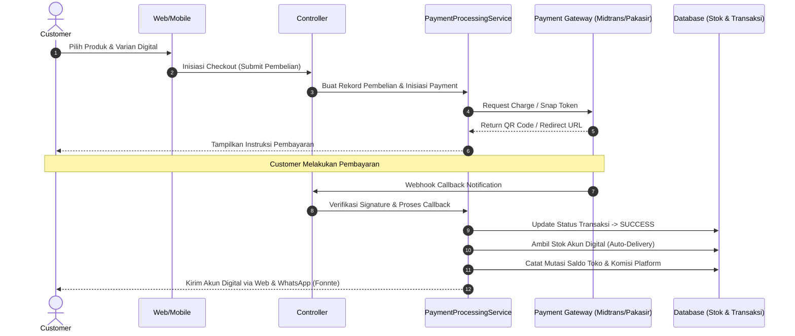

# 📁 Struktur File & Analisis Arsitektur Project Lapaktifikasi Web

Dokumen ini berisi pemetaan struktur berkas (directory tree) serta analisis arsitektur komprehensif dari sistem **Lapaktifikasi Web** — Platform Marketplace & E-Commerce Produk Digital berbasis **Laravel 10.x**.

---

## 📌 Ringkasan Eksekutif Arsitektur Sistem

- **Framework Mainstay**: Laravel 10.x (PHP 8.1+)
- **Pattern**: Model-View-Controller (MVC) + Service Layer + RESTful API Interface
- **Role System**:
  - `Admin` (Super Admin)
  - `Digital Admin` (Pengelola Inventaris Produk Digital)
  - `Premium Admin` (Pengelola Fitur & Customer VIP)
  - `Seller` (Penjual / Pemilik Toko)
  - `Customer` (Pembeli)
- **Payment Gateway Layer**: Interface Abstraction dengan Dukungan Multi-Gateway (**Midtrans** & **Pakasir**).
- **Notifikasi**: Integrasi WhatsApp API Gateway via Fonnte (`FonnteService`).
- **Autentikasi**: Web Session Guard (Blade UI) & Token-based API Authentication (`Laravel Sanctum`).

---

## 🌲 Peta Pohon Direktori Utama (Folder Tree)

```text
lapaktifikasi_web/
├── app/                        # Logika Utama Aplikasi (Backend Code)
│   ├── Contracts/              # Interface Abstraksi (Payment Gateways)
│   ├── Enums/                  # Enum Status & Role System
│   ├── Exceptions/             # Handler Penanganan Error
│   ├── Http/
│   │   ├── Controllers/        # Controller Web (Blade Route Handlers)
│   │   │   └── Api/            # Controller RESTful API (Sanctum)
│   │   └── Middleware/         # Filter Keamanan & Hak Akses
│   ├── Jobs/                   # Asynchronous Queue Jobs (Notifikasi, Processing)
│   ├── Mail/                   # Template Email
│   ├── Models/                 # Eloquent ORM Data Models (25 Models)
│   ├── Notifications/          # Sistem Notifikasi
│   ├── Observers/              # Model Observers (Event Listeners)
│   ├── Policies/               # Kebijakan Otorisasi Access
│   ├── Providers/              # Service Providers Bootstrapping
│   └── Services/               # Domain Business Services & Payment Processing
│       └── Gateways/           # Driver Payment Gateway (Midtrans & Pakasir)
├── bootstrap/                  # Inisialisasi Boot Framework Laravel
├── config/                     # Berkas Konfigurasi Aplikasi (19 File Config)
├── database/                   # Basis Data
│   ├── factories/              # Factory Generator Data Pengujian
│   ├── migrations/             # Migration Schema Database (49 Files)
│   └── seeders/                # Data Seeder Awal Sistem
├── public/                     # Public Web Root (Assets, CSS, JS, Uploaded Files)
├── resources/                  # Frontend Resources
│   ├── css/                    # Assets CSS & Styling
│   ├── js/                     # Assets JavaScript Frontend
│   └── views/                  # Template UI Blade Components & Pages
│       ├── admin/              # Dashboard & Fitur Super Admin
│       ├── auth/               # Halaman Login, Register, Lupa Password
│       ├── customer/           # Portal Customer / Pembeli
│       ├── dashboard/          # Dashboard Utama Multi-role
│       ├── digital_admin/      # Panel Admin Produk Digital
│       ├── errors/             # Custom Error Views (404, Maintenance)
│       ├── invoice/            # PDF Invoice Template (DomPDF)
│       ├── laporan/            # Laporan Transaksi
│       ├── pembayaran/         # Halaman Checkout & Status Pembayaran
│       ├── pengaturan/         # Pengaturan Profil & Ganti Password
│       ├── premium_admin/      # Panel Admin Premium
│       ├── premium_customer/   # Portal Customer VIP / Tier Premium
│       ├── produk/             # Katalog Produk & Form Pengelolaan
│       ├── produk_digital/     # Pengelolaan Produk Digital
│       └── seller/             # Dashboard Toko & Fitur Seller
├── routes/                     # Definisi Rute Aplikasi
│   ├── api.php                 # Endpoints RESTful API
│   ├── channels.php            # WebSocket / Event Channels
│   ├── console.php             # Artisan Command Console Routes
│   └── web.php                 # Rute Halaman Web Blade UI
├── storage/                    # Storage Berkas Log, Session, & Files Storage Link
├── tests/                      # Testing Automated Suite (Feature & Unit Tests)
├── .env                        # Environment Configuration
├── composer.json               # Dependensi Package PHP
├── package.json                # Dependensi Package Frontend (Node/Vite)
├── api.md                      # Dokumentasi RESTful API Engine
├── erd.md                      # Dokumentasi Entity Relationship Diagram Database
├── README.md                   # Dokumentasi Utama Proyek
└── struktur.md                 # Dokumentasi Struktur Berkas (File Ini)
```

---

## 🔍 Analisis Mendalam komponen Direktori `app/`

### 1. `app/Contracts/`
Menyediakan interface abstraksi untuk komponen modular:
- `PaymentGatewayInterface.php`: Kontrak baku fungsi payment gateway (`createTransaction`, `verifyWebhook`, `getTransactionStatus`).

### 2. `app/Enums/`
Konstanta tipe data aman (Type-safe Enums) untuk status sistem:
- `Role.php`: Definisi enum peran pengembang/pengguna.
- `PembelianStatus.php`: Enum status alur transaksi (`PENDING`, `SUCCESS`, `EXPIRED`, `FAILED`, `CANCELLED`).
- `StokStatus.php`: Enum ketersediaan akun/stok (`AVAILABLE`, `SOLD`, `RESERVED`).

### 3. `app/Http/Controllers/`
Merupakan pengendali logika rute UI Blade Web:
- **Pengaturan & Auth**: `AuthController.php`, `PengaturanController.php`.
- **Manajemen Marketplace & Toko**:
  - `SellerTokoController.php`: Registrasi & pengaturan toko seller.
  - `SaldoTokoController.php`: Manajemen dompet/saldo toko & penarikan.
  - `KelolaSellerController.php`, `KelolaCustomerController.php`: Admin manajemen pengguna.
- **Produk & Stok Digital**:
  - `ProductController.php`: Manajemen produk fisik / standar.
  - `ProductDigitalController.php`: Pengelolaan produk & varian digital.
  - `DigitalAdminController.php`: Panel inventaris produk digital khusus admin.
- **Transaksi & Payment Gateway**:
  - `PembayaranController.php`: Inisiasi checkout, bukti bayar, & klaim voucher.
  - `MidtransController.php`: Endpoint webhook callback dari Midtrans.
  - `PakasirController.php`: Endpoint webhook callback dari Pakasir.
- **Voucher & Sistem Loyalitas**:
  - `AdminVoucherController.php`, `SellerVoucherController.php`: Pembuatan & pengelolaan promo voucher.
  - `PremiumCustomerController.php`, `PremiumAdminController.php`: Pengelolaan tier customer VIP (Gold, Platinum, dll.), referral, & badge toko.
- **Laporan & Setting**:
  - `LaporanController.php`: Cetak laporan PDF & filter transaksi.
  - `SettingKomisiController.php`: Konfigurasi potongan komisi platform per transaksi.

### 4. `app/Http/Controllers/Api/`
Mengelola RESTful API yang dikonsumsi oleh Aplikasi Mobile (Android/iOS):
- `AuthController.php`: Token-based Login, Register, Logout Sanctum.
- `CatalogController.php`: API Feed Katalog Produk, Detail, & Pencarian.
- `CheckoutController.php`: Inisiasi transaksi & pemrosesan via API.
- `SellerController.php` & `SellerProductController.php`: API Toko & manajemen produk seller.
- `SellerVoucherController.php`: API promo voucher toko.
- `CustomerPremiumController.php`: API Tier member & benefit customer.
- `AdminController.php`: API Manajemen Backoffice.

### 5. `app/Http/Middleware/`
Menyediakan layer proteksi keamanan & otorisasi:
- `AdminOnly.php`: Membatasi akses khusus Super Admin.
- `OnlySeller.php`: Membatasi akses khusus Seller terverifikasi.
- `OnlyCustomer.php`: Membatasi akses khusus Customer.
- `CheckBannedUser.php`: Memblokir pengguna yang status akunnya ditangguhkan (banned).
- `CheckMaintenanceMode.php`: Mengalihkan trafik ke halaman maintenance saat perbaikan server.
- `RedirectIfMustChangePassword.php`: Memaksa pengguna mengganti password default demi keamanan.
- `ResetHeaders.php`, `CheckIdCustomer.php`, `PreventCustomer.php`.

### 6. `app/Models/` (25 Eloquent Models)
Pemetaan tabel basis data ke objek PHP:
- **Pengguna & Akses**: `User.php`, `CustomerModel.php`, `Toko.php`, `SellerBadge.php`.
- **Katalog & Stok**: `Produk.php`, `ProdukModel.php`, `TipeLayanan.php`, `VarianLayanan.php`, `StokAkun.php`, `ScreenshotsProdukModel.php`.
- **Transaksi & Pembayaran**: `Pembelian.php`, `PembelianLog.php`, `Pembayaran.php`, `BeliProdukModel.php`, `ProdukTerjualModel.php`, `MutasiSaldo.php`.
- **Gateway Webhooks**: `MidtransWebhookLog.php`, `PakasirWebhookLog.php`.
- **Gamifikasi & Diskon**: `Voucher.php`, `VoucherKlaim.php`, `CustomerTier.php`, `CustomerTierLog.php`.
- **Fitur Tambahan**: `Review.php`, `Laporan.php`, `SettingKomisi.php`.

### 7. `app/Services/`
Layer logika bisnis terpisah (Domain Business Layer):
- `PaymentProcessingService.php`: Layanan utama orkestrasi status transaksi, mutasi saldo, & eksekusi pengiriman stok otomatis.
- `KomisiService.php`: Kalkulasi pembagian komisi platform & pendapatan seller.
- `FonnteService.php`: Integrasi pengiriman SMS / WhatsApp Gateway notification.
- **`app/Services/Gateways/`**:
  - `PaymentGatewayFactory.php`: Factory Pattern penentu driver gateway (Midtrans / Pakasir).
  - `MidtransGateway.php`: Implementasi API SNAP Midtrans.
  - `PakasirGateway.php`: Implementasi API Pakasir.

---

## 💾 Analisis Skema Database `database/migrations/`

Terdapat **49 file migrasi** yang mengelola skema basis data secara modular:

1. **Autentikasi & Pengguna**: `tbl_roles`, `users`, `tbl_customer`, `password_reset_tokens`, `personal_access_tokens`.
2. **Pengelolaan Toko & Komisi**: `tbl_toko`, `tbl_setting_komisi`, `tbl_mutasi_saldo`, `tbl_seller_badge`, `tbl_toko_badge`.
3. **Katalog Produk Digital**: `tbl_produk`, `tbl_tipe_layanan`, `tbl_varian_layanan`, `tbl_stok_akun`, `tbl_review`.
4. **Transaksi & Webhook**: `tbl_pembelian`, `tbl_pembayaran`, `tbl_pembelian_log`, `midtrans_webhook_logs`, `pakasir_webhook_logs`.
5. **Voucher & Customer Tiers**: `vouchers`, `voucher_klaims`, `customer_tiers`, `customer_tier_logs`.
6. **Optimasi & Keamanan**: `add_performance_indexes`, `add_banned_fields_to_users_and_toko_tables`.

---

## 🎨 Analisis Tampilan Frontend `resources/views/`

Tampilan UI dibangun menggunakan **Laravel Blade Templates** yang terorganisir per area modul:

- `layout.blade.php`: Layout induk utama (Navigation bar, Sidebar, Footer, Asset scripts).
- `welcome.blade.php`: Halaman Landing Page Marketplace Utama.
- `admin/`: Antarmuka Super Admin untuk pengelolaan seller, customer, saldo toko, komisi, & voucher global.
- `seller/`: Dashboard Mitra Seller untuk melihat statistik penjualan, mutasi saldo, kelola voucher, & profil toko.
- `customer/` & `premium_customer/`: Portal pelanggan untuk belanja, histori transaksi, klaim voucher, referral, & status tier VIP.
- `produk/` & `produk_digital/`: Halaman katalog, form tambah/edit produk, upload varian digital, & ekstrak screenshot.
- `pembayaran/` & `invoice/`: Modul checkout, integrasi instruksi bayar, serta invoice PDF otomatis (`pdf_invoice.blade.php`).

---

## 🛣️ Analisis Pemetaan Rute `routes/`

- **`routes/web.php`**:
  - **Rute Publik**: Landing page, katalog produk, pencarian toko, detail layanan.
  - **Rute Auth**: Login, Register, Lupa Password, Reset Password.
  - **Rute Webhook (Tanpa CSRF)**: Callback otentikasi pembayaran dari Midtrans (`/midtrans/notification`) dan Pakasir (`/pakasir/notification`).
  - **Group Middleware `auth`**: Dashboard terproteksi berdasar role (`AdminOnly`, `OnlySeller`, `OnlyCustomer`).
- **`routes/api.php`**:
  - Rute Publik API: Register, Login, Katalog Public Endpoint.
  - Rute Terproteksi `auth:sanctum`: Checkout Mobile, Profile, Toko Seller API, Claim Voucher API.

---

## ⚙️ Analisis Konfigurasi & Berkas Penting Root `config/`

- `config/midtrans.php` & `config/pakasir.php`: Kredensial API Key & Merchant ID gateway pembayaran.
- `config/referral.php`: Pengaturan reward & komisi program referral customer.
- `config/dompdf.php`: Pengaturan renderer PDF untuk invoice & laporan.
- `config/sanctum.php`: Konfigurasi durasi & domain token API Sanctum.
- `api.md`: Dokumentasi teknis endpoint RESTful API untuk developer mobile app.
- `erd.md`: Diagram hubungan antartabel database.

---

## 🔄 Alur Kerja Sistem Utama (Core Workflow)



---

## 📝 Kesimpulan

Struktur berkas **Lapaktifikasi Web** dirancang dengan sangat rapi dan modular sesuai standar industri framework Laravel. Pemisahan antara **Core Logic (`app/Services`)**, **Gateway Abstraction (`app/Contracts`)**, **Multi-role Middleware**, **REST API Engine**, serta **UI Blade** memastikan aplikasi ini sangat mudah dipelihara (*maintainable*), dikembangkan lebih lanjut (*extensible*), dan siap mendukung skala transaksi tinggi.
